## 1 PYTHON CORE 2.0
### 1.1 Синтаксис, змінні, типи даних, оператори

print ("Hello World!")
print("Hello Git")

## Введення (отримання даних)
name = input("Enter please your name: ").strip()

banned_names = ["володимир", "путін", "росія", "росіянин", "тварина"]

if name.lower() in banned_names:
    print("Доброго вечора, ми з України")
else:
    print(f"Привіт, {name}!")

## Змінна
age = 20
user_name = "Boris"
user_age = 30
ADULT_THR = 18

### Наступна змінна user_name представляє ім'я користувача та отримує значення рядка "Boris". Змінна user_name тепер вказує на область пам'яті, де зберігається рядок "Boris". 
### Це як етикетка на коробку, щоб краще розуміти, що в ній зберігається. 

## Комплексні числа
int_number = 3
float_number = 3.3
complex_number = 3.3 + 2j

## Логічний тип данних
is_active = True
is_delete = False

age = 18
is_adult = age >= 18  # True

age = 15
is_adult = age >= 18  # False

### Логічний (булевий) тип у Python, відомий як bool, є основним типом даних, який використовується для представлення істинності або хибності. Цей тип даних має лише два можливі значення: True or False

## F-рядок — це такий шаблон, який дозволяє зручним чином генерувати рядок, підставляючи результат виконання виразів у потрібне місце в шаблоні.

### легка конструкція f-рядків
name = "Andrii"
hello_string = f"Hello, {name}!" # имя Андрей находит

### комплексна конструкція f-предл
s1 = "Hello"
s2 = "world!"
joined_string = s1 + " " + s2

s1 = 'Hello'
s2 = 'world!'
joined_string = f"{s1} {s2}"   # Hello world получается!

## ТИП NONE - Python використовується для позначення відсутності значення або "нічого"
connect_to_database = None

### Інструкція (statement) — це пов'язаний набір слів і символів із синтаксису мови, які об'єднуються, щоб виразити одну ідею, одну інструкцію для машини.
### У Python інструкція — це мінімальна одиниця вираження, яку інтерпретатор може виконати. Іншими словами, інструкція — це один із кроків, які вказують програмі, що робити. 
### Це може бути проста команда, як присвоєння значення змінній, або складніша структура.

x3 = 2
y3 = x3 + 10

a = 1
b = 2
c = a + b + 10

## У Python вираз (expression) — це комбінація значень, змінних, операторів та викликів функцій, які інтерпретатор обчислює ("виконує") для отримання якогось результату. 
## Вирази завжди щось повертають. Іншими словами, кожного разу, коли Python обчислює вираз, він повертає або виводить яке-небудь значення.

a = 1
b = 2
c = a + b + 10

## ОПЕРАТОРИ ТА ОПЕРАНДИ

### Операнд — це об'єкт, який маніпулюється оператором. Це може бути змінна, літерал (наприклад, число або рядок) або більш складний вираз. 
### Наприклад, у виразі 5 + 3 5 і 3 є операндами.

### Оператор — це символ або ключове слово, яке застосовується до операндів і виконує певну операцію. Вищезгаданий символ + є оператором додавання. 
### Оператори можуть бути різних видів: арифметичні, порівняння, логічні тощо.

side_a = 10
side_b = 5

hypotenuse = (side_a**2 + side_b**2)**0.5
hypotenuse = 11.180339887498949

S = side_a * side_b / 2
S = 25 # Після розрахунку змінна S буде дорівнювати 25.0. Зверни увагу, що змінна S стала типу float, хоча в правій стороні виразу стоять тільки числа int. Так завжди буває при операціях ділення.
### Щоб отримати тільки цілу частину, треба використовувати операцію ділення без остачі //

n = 5000

hours = n // (60 * 60)
minutes = (n - hours * 60 * 60) // 60
seconds = n - hours * 60 * 60 - minutes * 60

### Цей фрагмент коду призначений для обчислення кількості годин, хвилин і секунд у заданій кількості секунд n. Це корисно, наприклад, для перетворення секунд у більш звичний формат часу.
### Спочатку ми привласнюємо змінній n початкове значення 5000, це називається ініціалізація змінної. Число 5000 представляє загальну кількість секунд, які потрібно розбити на години, хвилини та секунди. 
### Далі в нас іде інструкція hours = n // (60 * 60). Тут використовується цілочисельне ділення // для обчислення кількості повних годин у загальній кількості секунд. Оскільки одна година має 60 хвилин, 
### а кожна хвилина має 60 секунд, множимо 60 на 60, щоб отримати кількість секунд в одній годині. Потім ділимо n на це число, щоб отримати кількість повних годин, у нашому випадку це 1 година.
### Після обчислення годин знімаємо ці години із загальної кількості секунд n - hours * 60 * 60 і обчислюємо, скільки повних хвилин залишилося. Це робиться шляхом ділення залишку на 60 (кількість секунд в одній хвилині). 
### Отже, вираз minutes = (n - hours * 60 * 60) // 60 поверне нам 23.
### Нарешті, обчислюємо кількість секунд, які залишилися після вилучення годин і хвилин із загальної кількості seconds = n - hours * 60 * 60 - minutes * 60. 
### Це різниця між загальною кількістю секунд і кількістю секунд, які утворюють повні години та хвилини, у нас повинно бути 20 секунд.

## ОПЕРАТОР ВЗЯТТЯ
### Оператор взяття ділить одне число на інше і повертає залишок від цього ділення.

### 10 % 3 поверне 1, оскільки 10 ділиться на 3 три рази із залишком 1.
### 5 % 4 поверне 3, бо 15 ділиться на 4 три рази із залишком 3.
### 7 % 5 поверне 2, оскільки 7 ділиться на 5 один раз із залишком 2.

### Цей оператор часто використовується для перевірки на кратність, наприклад, визначаючи, є число парним чи непарним:
### Якщо x % 2 дорівнює 0, тоді x є парним.
### Якщо x % 2 дорівнює 1, тоді x є непарним.

## ПОРЯДОК ВИКОНАННЯ ОПЕРАЦІЙ У ВИРАЗІ
### Математичні операції виконуються по черзі, залежно від їхнього пріоритету (якщо не задати іншу черговість за допомогою дужок). 
### Множення та ділення мають вищий пріоритет, ніж додавання та віднімання.

##    ratio = 10
##  result = 8 * (ratio + 5) - ratio ** 2

## Якщо виникає подвійна ситуація при читанні виразу, намагайтеся їх групувати разом за допомогою дужок. 
## Візьмемо, наприклад, зведення у степінь негативного числа -3 і зведемо його у квадрат. На папері ми вчинили б саме так:

##    -3 ** 2  # -9

## Ми отримаємо -9, але це швидше за все не той результат, який ми очікували. А річ у тім, що в Python пріоритет операції зведення в степінь вищий за заперечення. 
## Тому беремо -3 у дужки та отримуємо очікуваний результат.

##    (-3) ** 2  # 9

### Порядок виконання операцій у виразі в Python визначає, які операції будуть виконуватися першими у складних виразах, що містять різні види операцій. 
### Цей порядок схожий на стандартний математичний порядок операцій, який використовується в більшості мов програмування.

## Перерахуємо основні правила застосування операцій у порядку їх пріоритету:

### Дужки (): Вирази всередині дужок мають найвищий пріоритет і виконуються першими. Дужки можуть бути використані для зміни звичайного порядку виконання.
### Піднесення до степеня **: Наступним виконується піднесення до степеня.
### Унарні плюс + та мінус -. Далі йдуть операції унарного плюса та мінуса (наприклад, -5 або +3).
### Множення *, ділення /, цілочисельне ділення //, остача від ділення %: Ці операції мають однаковий пріоритет і виконуються після унарних операцій.
### Додавання + та віднімання -. Виконуються після операцій множення та ділення.
### Операції порівняння ==, !=, >, <, >=, <=: Виконуються після арифметичних операцій.
### Логічні операції not, and, or: В кінці виконуються логічні операції, де not має вищий пріоритет, ніж and, який, у свою чергу, має вищий пріоритет, ніж or.

## Складемо програму, яка обчислює відстані між точками з координатами, формула відстані Евкліда для розрахунку наступна

###      x1 = 10
###    y1 = 10
###   x2 = 25
###     y2 = 25
###      d = ((x2 - x1)**2 + (y2 - y1)**2)**0.5

## Спочатку виконуються операції в дужках. У нашому випадку це x2 - x1 та y2 - y1. Вони відповідають за обчислення різниці між відповідними координатами двох точок.
## Далі виконується піднесення до квадрата **2 та застосовується до результатів (x2 - x1) і (y2 - y1), обчислених на попередньому кроці.
## Після обчислення квадратів різниць виконується додавання: сума (x2 - x1)**2 і (y2 - y1)**2, бо вона знаходиться в дужках.
## Останньою операцією у внутрішніх виразах є піднесення суми квадратів до степеня 0.5, що еквівалентно взяттю квадратного кореня. 
## Це дає кінцевий результат — відстань між двома точками, яка в нашому випадку дорівнює 21.213203435596427.

## ВИВІД ДАННИХ
### Можна виводити кілька елементів одночасно, відокремлюючи їх комами. 

### print("Значення x:", x) #виведе текст "Значення x:" і потім значення змінної x. 

b = "Power"
print("Knowledge = is :", b)   

### f-рядок print(f"Значення x: {x}") 

#для вставки значення x прямо в рядок. #Краще використовувати цей рядокa

### Після виклику print(), курсор автоматично переміщується на новий рядок, тому наступний виклик print() виведе текст уже на новому рядку. 
### Але цю поведінку можна змінити за допомогою параметра end. 

### print("Привіт", end=" ") #не перейде на новий рядок після виведення. 

print(f"Wish to learn", end = " and help the other ones ")

## ВВЕДЕННЯ ДАННИХ

### Працює через input, є приклад на самому початку коду
### Інтерпретатор буде чекати доти, доки не зустріне символ нового рядка (Enter). 
### Це означає, що ти маєш ввести якісь дані та натиснути клавішу Enter. Після цього весь введений з клавіатури текст буде повернений як результат роботи функції input.
### Функція input() може приймати рядок як параметр, який буде виведений на екран, перш ніж користувач зробить введення. Це корисно для виведення підказки або інструкції.

## ПРИВЕДЕННЯ ТИПІВ

### Функція input повертає тип str — рядок, і порівняти значення age з числом 18 не можна, бо не зрозуміло, як має відбуватися таке порівняння.
### Але можна перетворити тип змінної age в int за допомогою вбудованої функції int (функція називається так само, як і тип):

age = input("\nHow old are you? ")
age = int(age)

if age < 18:
    print("Access denied")
else:
    print("Access granted")

### Для перетворення рядків у числа з крапкою можна використовувати функцію float:

###     pi = float('3.14')

### Також можна перетворити практично будь-який Python-об'єкт у рядок функцією str:

###    pi_str = str(3.14)
###     age_str = str(29)

### Приведення до булевого типу (True або False) виконується функцією bool. Це може бути використано для перевірки істинності або хибності значень.
### Зазвичай числове значення 0, порожні колекції ([], (), {}) та None перетворюються на False. Усе інше — на True.

###     bool(0)  # False
###     bool(1)  # True

a = float(input("Enter side length: "))
P = 4 * a
print(f"Perimeter of the square is {P}")

#Інструкція input("Введіть сторону квадрата a: ") просить користувача ввести довжину сторони квадрата. Далі float(...) конвертує цей рядок у дійсне число.
#Це важливо, тому що введення з input() завжди є рядком, і його потрібно перетворити в числовий тип для математичних обчислень.

## Задача на закупівлю круасанів, кави, стаканчиків

## Встановлюємо ціни на продукти
price_per_croissant = 1.04
price_per_glass = 0.34
price_per_coffee_pack = 4.42

## Кількість кожного продукту
num_croissants = int(input("Enter quantity of croissants: "))
num_glasses = int(input("Enter quantity of drinking glasses: "))
num_coffee_packs = int(input("Enter quantity of coffee packs: "))

## Обчислення загальної вартості
total_cost = num_croissants * price_per_croissant + \
             num_glasses * price_per_glass + \
             num_coffee_packs * price_per_coffee_pack

## Визначаємо кількість повних доларів і центів
total_dollars = int(total_cost)
total_cents = int(total_cost * 100)

## Вивід результату
print(f"Total price in dollars: {total_dollars} dollars")
print(f"Total price in US cents: {total_cents} cents")

# ОПЕРАТОРИ / та //
### Про приведення типів у Python ми хотіли б тобі розповісти ще один момент. Оператори / і // використовуються для виконання операцій ділення, але вони працюють по-різному.
### Оператор / ділення завжди повертає результат ділення як дійсне число float, навіть якщо обидва операнди є цілими числами.
### Наприклад, тут ми виконуємо дію над числами типу int, але результат завжди буде float:

###     10 / 5 поверне 2.0.
###       7 / 2 поверне 3.5.

### Оператор // цілочисельного ділення повертає результат ділення з відкиданням дробової частини. Фактично він виконує округлення вниз до найближчого цілого числа. 
### А ось тип повернутого значення залежить від типу операндів.
### Якщо обидва операнди — цілі числа int, результат також буде цілим числом.
### Наприклад, вираз 7 // 2 поверне ціле число 3, бо 7 і 2 — цілі числа типу int.
### Якщо хоча б один з операндів має дійсний тип float, результат також буде дійсним числом. Наприклад, вирази 7.0 // 2 або 7 // 2.0 повернуть дійсне число 3.0, яке має тип float.

### Таким чином, основна відмінність між / і // полягає в тому, що перший завжди повертає float, навіть якщо ділення виходить націло, 
### тоді як другий може повертати як int, так і float, залежно від типів операндів.

## 1.2 РОБОТА З РЯДКАМИ ТА КОЛЕКЦІЇ

### Колекція у Python — програмний об'єкт (змінна-контейнер), що зберігає набір значень одного або різних типів.
### Простою мовою, колекція — це сховище інформації, каталог, побудований за якимось принципом. Сховища бувають різними: може бути мішок, з якого ти дістаєш вміст навмання, 
### може бути розкладений за абеткою каталог, у якому дуже легко щось знайти, або труба, з якої можна дістати тільки те, що лежить з краю, тощо.

### Наприклад, щоб швидко знайти щось, використовують словники; для зберігання впорядкованих даних, коли порядок має значення — списки та кортежі; 
### для зберігання тільки унікальних елементів — множини; для зберігання символів — рядки тощо.

## Основні властивості колекцій:

### - Впорядкованість. Впорядкований контейнер (колекція) дає можливість звертатися до своїх елементів за індексом (номером) і гарантує, що порядок елементів зберігається.
### - Змінність. Якщо колекція змінювана, то її вміст можна змінювати, не створюючи нову колекцію. Наприклад, додавати, видаляти, заміняти елементи колекції.
### - Унікальність. Унікальність стосується вмісту колекції, чи допускається зберігання однакових об'єктів.

## Колекції дозволяють групувати декілька елементів в єдину одиницю (змінну), що є корисним для обробки та аналізу даних у програмах.

## Основні типи колекцій у Python:

### - Списки (Lists). Впорядковані колекції, які можуть містити елементи будь-якого типу. Списки є змінними, що означає можливість зміни, додавання або видалення елементів після їх створення.

### - Кортежі (Tuples). Схожі на списки, але вони незмінні. Це означає, що після створення кортежу його не можна змінювати. Кортежі часто використовуються для зберігання даних, 
### які не повинні змінюватися впродовж роботи програми.

### - Словники (Dictionaries). Колекції пар ключ-значення, де кожний ключ є унікальним. Словники використовуються, коли потрібен швидкий доступ до елементів за ключем.

### - Множини (Sets). Неупорядковані колекції унікальних елементів. Використовуються для видалення дублікатів і виконання операцій, які типові для математичних множин, таких як об'єднання, перетин, різниця.

### - Заморожені множини (Frozen Sets). Це незмінні версії множин. Такі множини не можна змінювати після їх створення.

### Список — це впорядкований змінюваний контейнер даних. Списки не диктують розробнику тип даних, який можна помістити в цей контейнер, і можуть містити будь-які типи даних 
### у будь-якому зручному порядку. Це одна з найбільш універсальних і важливих структур даних.

### Існують два способи створити порожній список:

### за допомогою функції list
### за допомогою літерального позначення []

###      my_list = list()

###      empty_list = []

### Ви можете створити список, просто перерахувавши його елементи у квадратних дужках, розділених комами. Наприклад, наступна інструкція створює список із п'ятьох чисел.

my_list = [1, 2, 3, 4, 5]

### Списки можуть містити різні типи даних:

my_list = [1, "Hello", 3.14]

### Якщо ви хочете додати щось до свого списку, використовуйте метод append(). 
### Подумайте про це як про додавання нової коробки в кінець свого ряду коробок. Наприклад, my_list.append(4) додасть число 4 в кінець списку.

### Для додавання нового елемента до списку ми використали метод. Але що таке метод?
### Метод у Python — це функція, яка "прикріплена" до об'єкта і виконує дії, пов'язані з цим об'єктом. Кожен тип об'єкта має свій набір методів.

### Наприклад, у списків є методи для додавання та видалення елементів, обчислення довжини списку тощо. А зараз, щоб використовувати метод, тобі потрібно вказати об'єкт my_list, 
### а потім через крапку написати назву методу і в дужках додати необхідні аргументи my_list.append(4), якщо вони, звісно, потрібні.
### Щоб видалити елемент списку, використовуй метод remove(). Аргументом метод remove приймає елемент списку, який потрібно видалити. 
### Наприклад, виклик методу my_list.remove("Hello") видалить рядок "Hello" зі списку.

my_list = []

my_list.append(2024)       # [2024]
my_list.insert(1, "Python") # [2024, "Python"]
my_list.insert(2, 3.12)     # [2024, "Python", 3.12]

## Впорядкованість
### Під впорядкованістю варто розуміти властивість контейнера зберігати порядок елементів при роботі з ним. Видаляючи елемент, додаючи новий, роблячи вставку/видалення з кінця/початку/середини контейнера, 
### ти гарантуєш, що всі елементи, окрім тих, яких безпосередньо стосувалася операція, зберігають порядок. 
### Найкориснішою властивістю впорядкованості є можливість доступу до елементів контейнера за індексом цього елемента в контейнері.

### У Python синтаксис доступу за індексом виглядає так:

some_iterable = ["a", "b", "c"]
first_letter = some_iterable[0]
middle_one = some_iterable[1]
last_letter = some_iterable[2]

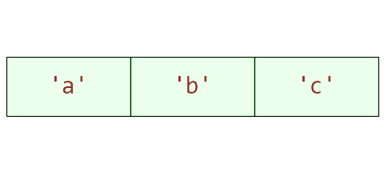

### Розглянемо докладно операції, які ми тут виконали. У другому рядку ми зберегли у змінну first_letter літеру "a"  — це перший елемент списку some_iterable. Індекс елементів у списків Python починається з 0, як і в більшості мов програмування, тому індекс елемента "a" дорівнює 0. Третій рядок — це звернення до другого елемента списку some_iterable, його індекс дорівнює 1 — це літера "b" і ми зберігаємо її у змінній middle_one.
### Четвертий рядок — це звернення до останнього елемента списку some_iterable, літери "c", яку ми збережемо у змінній last_letter, а індекс елемента дорівнює 2.

### Python підтримує індексування елементів з кінця. Для цього потрібно додати - і вказати номер елемента з кінця. Оскільки у Python -0 == 0, то перший елемент з кінця — це -1, другий — -2 і так далі. 
### Наш приклад можна переписати, використовуючи індексування з кінця, ось так:

some_iterable = ["a", "b", "c"]
first_letter = some_iterable[-3]
middle_one = some_iterable[-2]
last_letter = some_iterable[-1]

### Найкориснішою властивістю змінності списків є можливість змінити значення будь-якого елемента списку:
 
some_iterable = [1, 2, 3]

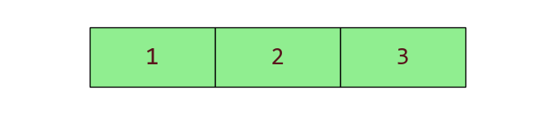

### Змінимо другий елемент списку some_iterable на -2. Другий елемент списку має індекс 1, а отже:

some_iterable[1] = -2

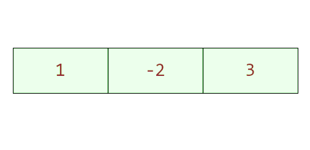

### Розглянемо, які ще методи списків нам доступні. Щоб повернути елемент за індексом i та видалити його зі списку, ми використовуємо метод pop(i). 
### За замовчуванням i = -1, і метод повертає останній елемент списку.

### Нехай у нас є наступний список із букв:

chars = ['a', 'b', 'c']

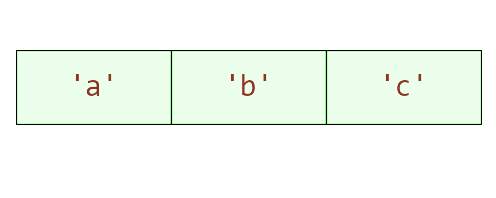

### Якщо ми викличемо метод pop з індексом 1, то змінна last буде зберігати значення "b". Оскільки індекс елемента "b" саме дорівнює 1.

last = chars.pop(1)

### Сам список набуде наступного вигляду, вже без елемента "b".

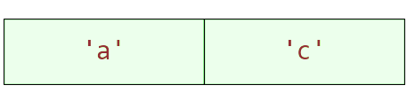

### Якщо виникає потреба розширити один список іншим, то використовують метод extend. 
### Наприклад, ми маємо два списки chars та numbers і хочемо, щоб у список chars додалися всі елементи списку numbers.

chars = ['a', 'b', 'c']
numbers = [1, 2]

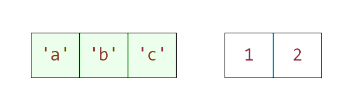

### Використовуючи наступну операцію, ми розширимо список chars елементами списку numbers. Список numbers при цьому не зазнає змін.

chars = ['a', 'b', 'c']
numbers = [1, 2]

chars.extend(numbers)

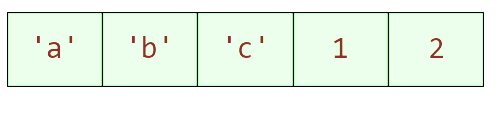

### Для вставки елемента x на позицію з індексом i у список ми використовуємо метод insert(i, x). Розглянемо приклад, сформуємо список chars

chars = ["a", "c"]

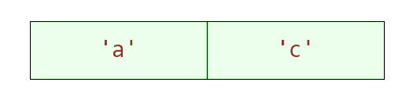

### Та за допомогою методу insert вставимо між символами "a" і "c" елемент із символом "b". 
### Це місце з індексом 1, де зараз знаходиться символ "c", отже, треба виконати наступний виклик методу insert.

chars.insert(1, "b")

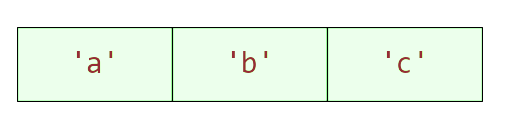

### Для очищення списку від елементів треба використати метод clear(). Після цього список буде пустим, без жодного елемента.

chars = ['a', 'b']
chars.clear() # []

### Метод index() у списках Python використовується для знаходження індексу першого входження заданого елемента у списку. Якщо елемент не знаходиться у списку, Python викине помилку ValueError. Обробляти такі помилки ми навчимося далі по курсу.

chars = ['a', 'b', 'c', 'd']
c_ind = chars.index('c')

### У нашому випадку змінна c_ind зберігає значення 2 — це індекс елемента 'c' у списку chars.

### Метод count() у списках Python використовується для підрахунку кількості разів, скільки певний елемент зустрічається у списку. Цей метод корисний, коли вам потрібно дізнатися, чи часто і як часто певний елемент присутній у списку. У наступному прикладі ми підрахуємо, скільки чисел 2 зустрічається у списку my_list.

### Якщо елемент відсутній у списку, count() поверне 0. Метод count() є простим і ефективним способом для визначення частоти елементів у списку, що може бути корисним у різних сценаріях аналізу даних та обробки інформації. Будь-яка колекція дозволяє дізнатися кількість елементів у ній за допомогою вбудованої функції len.

my_list = [1, 2, 3, 4, 5]
print(len(my_list))

### Тут функція print поверне 5 — кількість елементів у списку.

### Метод sort() у списках Python використовується для сортування елементів списку в порядку зростання або спадання. 
### Цей метод модифікує вихідний список, тобто сортування відбувається "на місці", і він не створює новий відсортований список.
### За замовчуванням sort() впорядковує елементи списку за зростанням, від меншого до більшого.

nums = [3, 1, 4, 1, 5, 9, 2]
nums.sort()
print(nums)  # Виведе [1, 1, 2, 3, 4, 5, 9]

### Якщо потрібно відсортувати елементи в порядку спадання, використовуй аргумент

reverse=True.

nums.sort(reverse=True)
print(nums)  # Виведе [9, 5, 4, 3, 2, 1, 1]

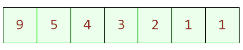

### Метод sort() також дозволяє сортувати за ключем, який визначає, як порівнювати елементи. Це може бути корисним, наприклад, при сортуванні списків, які містять вкладені колекції, або коли елементами списку є об'єкти.
### Наприклад, у наступному прикладі ми відсортуємо список за довжиною слова у списку.

words = ["banana", "apple", "cherry"]
words.sort(key=len)
print(words)  # Виведе ['apple', 'banana', 'cherry']

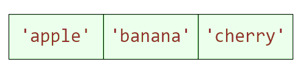

### Пам'ятайте, що метод sort() змінює сам список, на якому він був викликаний. Якщо потрібно зберегти початковий порядок елементів, розгляньте можливість створення копії списку перед сортуванням або використай функцію sorted(), яка повертає новий відсортований список. Також sort() працює тільки зі списками, де всі елементи можуть бути порівняні між собою. Наприклад, спроба відсортувати список, який містить і цифри, і рядки, призведе до помилки.

### Вбудований метод sorted() у Python використовується для сортування колекцій. Він відрізняється від методу sort(), який застосовується безпосередньо до списку, та змінює його: sorted() повертає новий відсортований об'єкт, залишаючи вихідний об'єкт без змін. Метод також використовує аргумент reverse=True, щоб відсортувати об'єкти у зворотному порядку, та за допомогою аргументу key можна вказати функцію, яка буде застосовуватися для визначення порядку сортування.

nums = [3, 1, 4, 1, 5, 9, 2]
sorted_nums = sorted(nums)
print(sorted_nums)  # Виведе [1, 1, 2, 3, 4, 5, 9]

sorted_nums_desc = sorted(nums, reverse=True)
print(sorted_nums_desc)  # Виведе [9, 5, 4, 3, 2, 1, 1]

words = ["banana", "apple", "cherry"]
sorted_words = sorted(words, key=len)
print(sorted_words)  # Виведе ['apple', 'banana', 'cherry']

### Оскільки sorted() повертає новий список, його можна використовувати з будь-якою колекцією, не тільки зі списками. Це робить sorted() дуже універсальним інструментом для сортування даних, незалежно від того, чи є вихідний об'єкт змінним.

## Meтод Copy
### Щоб повернути копію списку, ми використовуємо метод copy().

chars =  ['a', 'b']
chars_copy = chars.copy()

### У цьому прикладі ми створили змінну chars_copy, де зберегли копію списку chars, і тепер можемо виконувати будь-які дії над списком, бо в нас є збережена копія, до якої ми можемо завжди повернутися.

## Метод Reverse
### Він використовується, щоб змінити порядок елементів у списку на зворотний.

chars = ["banana", "apple", "cherry"]
chars.reverse()

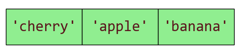

## Cловники

### Словник — це контейнер, який зберігає пари ключ-значення. Ключем може бути будь-який незмінний тип даних Python (число, рядок, кортеж тощо). Неможливо використовувати в якості ключа списки, 
### словники, множини або будь-які інші змінювані типи даних. Значенням словника може бути будь-який тип даних Python, включаючи призначені для користувача типи. Словники використовуються для зберігання даних, 
### які можна легко визначити та змінити за допомогою унікального ключа. Створення пустого словника:

my_dict = {}

### Для створення заповненого деякими значеннями словника достатньо перелічити пари ключ-значення через кому всередині фігурних дужок — ключ іде першим, потім двокрапка та значення.

my_dict = {"name": "Alice", "age": 25, "city": "New York"}

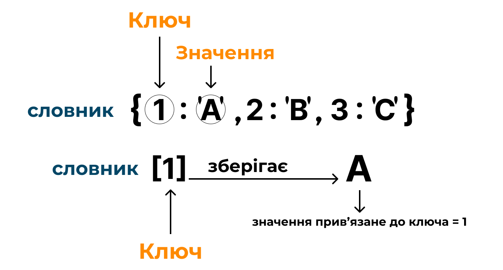

### Словники в першу чергу оптимізовані для швидкого доступу до значень за ключами, що робить їх ідеальними для використання у випадках, коли потрібен швидкий пошук даних. Можна виконувати різні операції зі словниками, такі як доступ до елементів, їх зміна, додавання, видалення, а також перевірка наявності ключів. Для доступу до значення у словнику за ключем використовуйте квадратні дужки із ключем. Наприклад, у нас є словник my_dict із ключем "name", і ми можемо отримати відповідне значення так:

my_dict = {"name": "Alice", "age": 25, "city": "New York"}
print(my_dict["name"])  # Виведе 'Alice'

### Щоб змінити значення або додати нову пару ключ-значення, просто використовуйте ключ для присвоєння нового значення:

my_dict["age"] = 26  # Змінює вік на 26
my_dict["email"] = "alice@example.com"  # Додає нову пару ключ-значення
print(my_dict)

### Ми змінили значення ключа "age" з 25 на 26 та додали нову пару ключ-значення 'email': 'alice@example.com' у словник. Видалити елемент за ключем можна за допомогою оператора del:

del my_dict["age"]
print(my_dict)

### Для перевірки, чи є ключ у словнику, використовуй оператор in:

print("name" in my_dict)
print("age" in my_dict)

## Виведе:
### True
### False

### Бо ключ "name" залишився у словнику my_dict, а ключ "age" ми видалили. Ці операції дозволяють ефективно керувати даними всередині словника, роблячи словники 
### однією з найбільш універсальних і потужних структур даних у Python.

## Методи словників

### Розглянемо методи словників, які найчастіше ми будемо використовувати надалі в курсі.

### Метод pop()
### Почнемо з методу pop(), який у словниках дозволяє видалити елемент за вказаним ключем і повернути його значення. Наприклад, якщо ми маємо словник my_dict = {"name": "Alice", "age": 25} і виконуємо age = my_dict.pop("age"), то змінна age отримає значення 25, а пара ключ-значення "age": 25 буде видалена зі словника. Якщо ключ не знайдено, метод викидає помилку, але можна встановити значення за замовчуванням другим аргументом, яке повертатиметься в такому випадку.

### Метод update()
### Метод update() використовується для оновлення словника іншим словником або парами ключ-значення. 
### Якщо в вас є словник my_dict = {"name": "Alice", "age": 25} і ви виконаєте my_dict.update({"email": "alice@example.com", "age": 26}), то словник my_dict буде оновлено новими парами ключ-значення, де ключ "email" буде додано в словник, а значення ключа "age" буде оновлено.

{'name': 'Alice', 'email': 'alice@example.com', 'age': 26}

### Метод clear()
### Метод clear() очищує словник, видаляючи всі його елементи. Після виклику my_dict.clear(), my_dict стане порожнім словником {}.

### Метод copy()
### Метод copy() створює поверхневу копію словника. Якщо використати new_dict = my_dict.copy(), то new_dict буде новим словником з тими самими парами ключ-значення, що і my_dict, але як окремий об'єкт.

### Метод get()
### Метод get() використовується для безпечного отримання значення за ключем зі словника. Основна перевага цього методу полягає в тому, що він не викликає помилку, якщо ключ не знайдено. Натомість, якщо ключ відсутній, get() повертає None або інше значення, яке ви можете визначити як значення за замовчуванням.

my_dict = {"name": "Alice", "age": 25}
age = my_dict.get("age")  # Поверне 25
gender = my_dict.get("gender")  # Поверне None, оскільки "gender" немає в словнику

### Коли ви використовуєте квадратні дужки [] для доступу до значення за ключем, отримаєте значення, якщо ключ існує. Проте, якщо ключ відсутній, Python викине помилку KeyError.

pythonCopy code
name = my_dict["name"]  # Поверне 'Alice'
gender = my_dict["gender"]  # Викличе KeyError, оскільки "gender" немає в словнику

### Головна різниця між використанням get() та прямим доступом до значення за ключем полягає в тому, як обробляється відсутність ключа. Метод get() є більш безпечним, оскільки він запобігає виникненню помилки KeyError та дозволяє тобі встановити значення за замовчуванням для випадків, коли ключ не знайдено. Отже, в майбутньому краще використовуй метод get() для отримання значення за ключем зі словника.

### Множини 
### Множини — це неврегульований контейнер, який містить тільки унікальні елементи. У множину можна додавати тільки незмінні типи даних.

### Щоб створити порожню множину, потрібно викликати функцію set()

empty_set = set()

### Множини не мають визначеного порядку елементів. Це означає, що ви не можете звернутися до елементів множини через індекс або отримати їх у певному порядку.
### Для створення заповненої множини достатньо передати будь-який об'єкт, що ітерується, у функцію set:

a = set('hello')

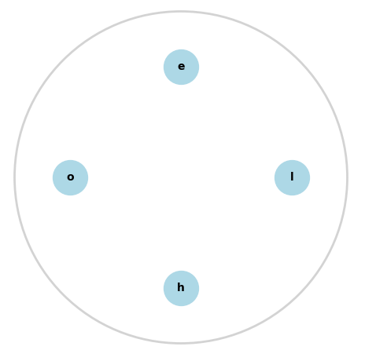

### Або ж скористатися синтаксисом з фігурними дужками (як у словниках), але елементи у фігурних дужках просто перелічити через кому без двокрапок:
b = {1, 2, 3, 4, 5}

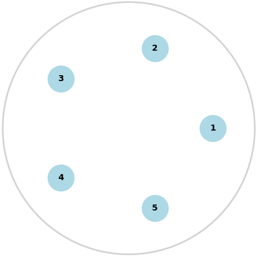

### Унікальність множини передбачає, що якщо множина вже містить такий елемент, то спроба додати ще один такий самий нічого не змінить.

numbers = {1, 2, 3, 1, 2, 3}

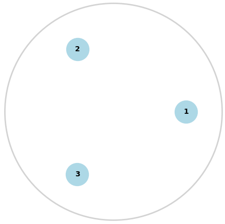

### Тому множини часто використовуються, коли потрібно забезпечити унікальність елементів, наприклад, для видалення дублікатів зі списку. Вони також корисні в ситуаціях, де потрібно виконати швидкі перевірки на наявність елемента. Приклад. Нехай у нас є список, з якого треба видалити дублікати

lst = [1, 2, 3, 1, 2, 2, 3, 4, 1].

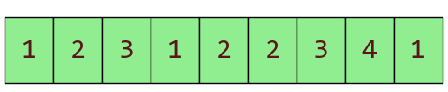

### Це можна зробити, перетворивши список у множину d_lst = set(lst).

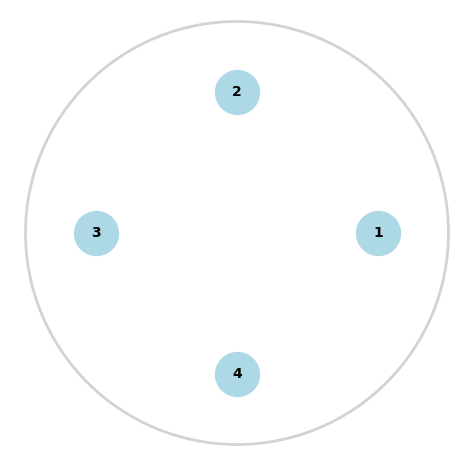

### А далі множину перетворити знову у список lst=list(d_lst).

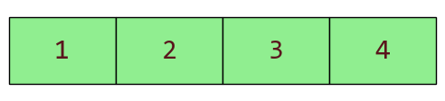

## Усе, так легко ми прибрали дублікати зі списку. Множини підтримують наступні методи:

### add(elem) — додає елемент у множину

numbers = {1, 2, 3}
numbers.add(4)
print(numbers)  # {1, 2, 3, 4}

### remove(elem) — видаляє елемент із множини, викликає виняток, якщо його немає

numbers = {1, 2, 3}
numbers.remove(3)
print(numbers)  # {1, 2}

### discard(elem) — видаляє елемент із множини і не викликає виняток, якщо його немає

numbers = {1, 2, 3}
numbers.discard(2)
print(numbers)  # {1, 3}

## Математичні операції над множинами
### Розглянемо детальніше, які корисні математичні операції можна робити над множинами. Спершу створимо дві множини a і b:

a = {1, 2, 3}

b = {3, 4, 5}

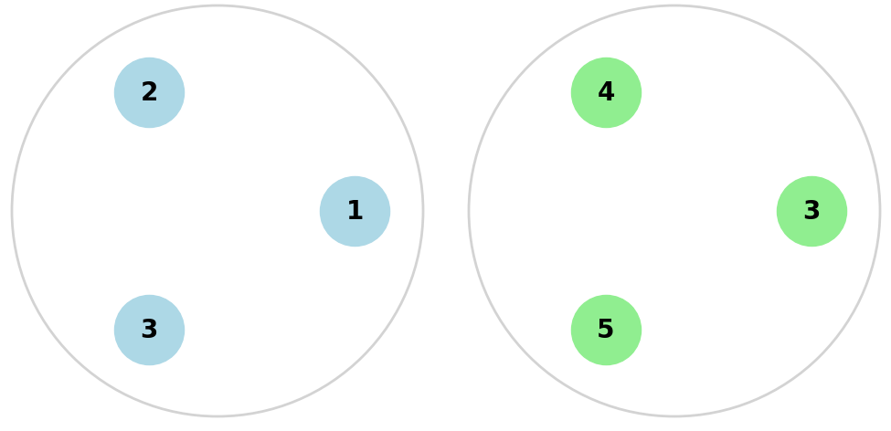

### Перетин двох множин включає лише ті елементи, які є в обох множинах. 
### Щоб знайти загальні елементи для двох множин, над ними треба виконати операцію & або використати метод intersection:

a = {1, 2, 3}
b = {3, 4, 5}
print(a.intersection(b))  # {3}
print(a & b)  # {3}

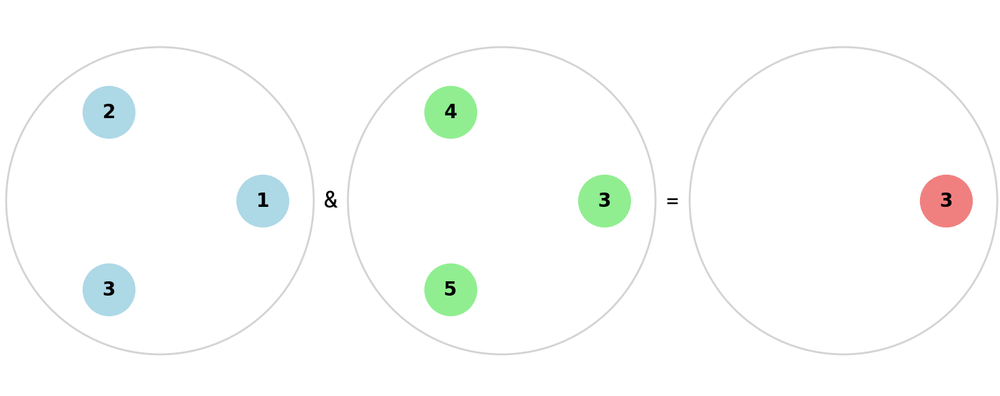

### Різниця між двома множинами включає елементи, які містяться в першій множині, але не містяться в другій. Можна також використовувати оператор - або метод difference:

a = {1, 2, 3}
b = {3, 4, 5}
print(a.difference(b))  # {1, 2}
print(a - b)  # {1, 2}

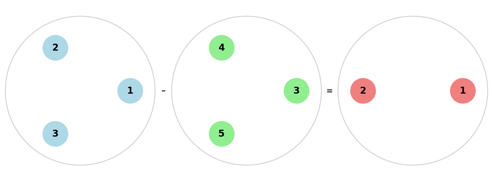

### Cиметрична різниця між двома множинами включає всі елементи, які містяться в одній множині, але не містяться в іншій, і навпаки. Щоб знайти всі елементи з двох множин, окрім загальних, нам необхідно використати оператор ^. Альтернативно, можна використовувати метод symmetric_difference:

a = {1, 2, 3}
b = {3, 4, 5}
print(a.symmetric_difference(b))  # {1, 2, 4, 5}
print(a ^ b)  # {1, 2, 4, 5}

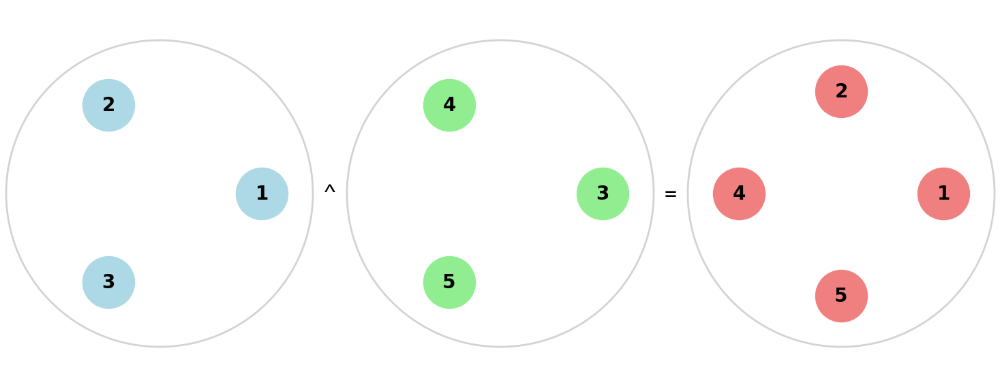

### Об'єднання двох множин включає всі елементи з обох множин, але без дублікатів. Це знаходиться за допомогою оператора | або методу union:

a = {1, 2, 3}
b = {3, 4, 5}
print(a.union(b))  # {1, 2, 3, 4, 5}
print(a | b)  # {1, 2, 3, 4, 5}

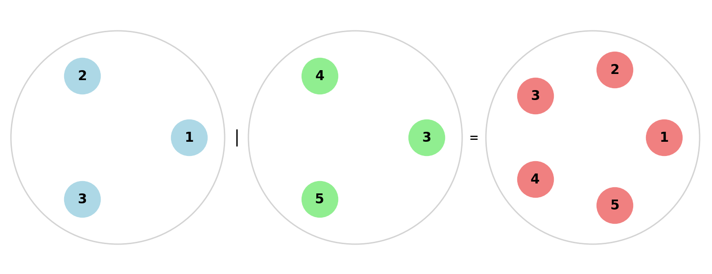

### Множини — це дуже потужний інструмент, коли необхідно знайти унікальні елементи в якомусь наборі і прибрати дублікати, а також найшвидший спосіб знайти загальні або відмінні елементи з декількох наборів.
### Заморожені множини в Python, відомі як frozenset, є подібними до звичайних множин set, але з ключовою відмінністю: вони є незмінними. Це означає, що після створення замороженої множини ви не можете додати або видалити елементи з неї. 

### Заморожену множину можна створити за допомогою функції frozenset():

my_frozenset = frozenset([1, 2, 3, 4, 5])

### У цьому прикладі ми створили заморожену множину з п'яти чисел.
### Неможливо змінити елементи замороженої множини після її створення. Ви не зможете використовувати методи add() або remove(), як у випадку зі звичайними множинами. Заморожені множини можуть використовуватися в якості ключів у словниках або як елементи інших множин, тому що вони є хешованими (і, отже, незмінними).

### Хоча ви не можете змінювати заморожені множини, над ними все ще можна виконувати різні операції, які не змінюють саму множину, такі як об'єднання, перетин і різниця:

a = frozenset([1, 2, 3])
b = frozenset([3, 4, 5])

union = a | b  # Об'єднання множин
intersection = a & b  # Перетин множин
difference = a - b  # Різниця множин
symmetric_difference = a ^ b  # Симетрична різниця

print(union)  # frozenset({1, 2, 3, 4, 5})
print(intersection)  # frozenset({3})
print(difference)  # frozenset({1, 2})
print(symmetric_difference)  # frozenset({1, 2, 4, 5})

### У цих прикладах результатом кожної операції буде нова заморожена множина. Заморожені множини корисні у випадках, коли тобі потрібно мати набір унікальних елементів, який не змінюватиметься, та коли потрібна можливість використовувати множини як ключі у словниках або як елементи інших множин.

## Кортежі

### Кортежі в Python — це важлива структура даних, подібна до списків, але з ключовою відмінністю: вони незмінні. Це означає, що після створення кортежу, не можна змінити його елементи, не можна додавати/видаляти/переставляти елементи. При спробі змінити кортеж, ви отримаєте повідомлення про помилку.

### Розглянемо основні аспекти кортежів. Щоб створити порожній кортеж, існують два способи:

my_tuple = tuple() # або
my_tuple = ()

### Створення ж непорожніх кортежів відбувається наступним чином:

my_tuple = (1, 2, 3)

### Якщо ви хочете створити кортеж з одним елементом, не забудьте поставити кому. Це важливо, запам'ятай це! Інакше ви отримаєте змінну, яка просто зберігає елемент кортежу.

my_tuple = (1,)

### Річ у тому, що Python використовує круглі дужки як математичні символи. Якщо написати вираз на кшталт my_tuple = (1), виникає невизначеність.
### Інтерпретатор розуміє такий вираз як суто математичний і просто прибирає зайві дужки, присвоюючи my_tuple значення 1. Щоб вказати, що це не математична операція, а саме кортеж, потрібно додати кому після значення.
### Тоді інтерпретатор однозначно зрозуміє, що ви хочете створити кортеж з одним елементом:

### Кортеж, як і список, може містити різні типи даних:

my_tuple = (1, "Hello", 3.14)

### Кортеж можна створити без дужок, ця операція називається упакування кортежу:

my_tuple = 1, "Hello", 3.14

### Із операції з кортежами ми маємо фактично тільки доступ до елементів. Ми можемо отримати доступ до елементів кортежу за допомогою індексації.

first_item = my_tuple[0]  # Отримати перший елемент

### Оскільки кортежі є незмінними, неможна додавати, видаляти або змінювати їх елементи після створення. Це робить їх ідеальними для використання в ситуаціях, де потрібно гарантувати, що дані залишаться без змін.
### Кортежі використовуються в багатьох сценаріях, наприклад, для зберігання набору констант або коли функція повертає кілька значень. 
### Також вони корисні в якості ключів словників, оскільки ключі повинні бути незмінними.
### Незмінність кортежів обмежує їх застосування, в порівнянні зі списками, але дає можливість використати кортежі як ключі для словника або елементи множини.

### Наприклад, розглянемо набір точок на площині (кортежі). Їх можна використовувати як ключі у словнику:

points = {
    (0, 0): "O",
    (1, 1): "A",
    (2, 2): "B"
}

### У словнику points використовуються кортежі з координатами точок як ключі, а значення — це імена (назва) точок.

## Hint:
### Головна різниця між кортежами та списками полягає в їхній незмінності. Кортежі — це чудовий вибір, коли тобі потрібна впорядкована колекція, яка не повинна змінюватися. 
### Списки ж ідеально підходять для випадків, коли тобі потрібна подібна до кортежу структура, але з можливістю модифікації.

## Методи рядків

### Рядок — це незмінна впорядкована послідовність символів у деякому кодуванні. За замовчуванням використовується кодування UTF-8, але можна працювати майже з усіма відомими таблицями кодування символів.
### У Python рядок теж можна розглядати як колекцію символів. Це означає, що рядки підтримують багато операцій, які зазвичай застосовуються до колекцій, таких як списки.
### Важливо тільки пам'ятати, що рядки в Python є незмінними (immutable), це значить, що ви не можете змінити окремі символи в рядку без створення нового рядка.

### Ми вже знаємо: щоб створити змінну типу "рядок", необхідно певний набір символів взяти в лапки. Ми будемо в основному використовувати два варіанти:

### Варіант перший — рядок береться в одинарні лапки (апостроф) 'some text'
### Варіант другий — рядок береться в подвійні лапки "some text"

### Різні варіанти використання лапок обумовлені тим, що при використанні одинарних лапок можна в рядку вказати подвійні та навпаки.

game_string = 'My favorite "Game"'

### Впорядкована послідовність означає, що до елементів рядка можна звертатися за індексом:

s = "Hello world!"
print(s[0])# H
print(s[-1])# !

### Незмінна послідовність означає, що якщо рядок уже створений, то змінити його не можна, можна тільки створити новий.

s = "Hello world!"
s[0] = "Q"# Тут буде викликано виняток (помилка) TypeError

### У Python рядки мають багато корисних "малих" методів, які дозволяють виконувати різноманітні операції обробки тексту. Ці методи дуже корисні для обробки та перетворення текстових даних у Python. Вони дозволяють виконувати найрізноманітніші задачі, пов'язані з рядками, від простого форматування до більш складної обробки тексту. Для того, щоб усі літери рядка перевести у верхній регістр, використовується метод upper:

s = "Hello" 
print(s.upper()) # Виведе 'HELLO'

### Для переведення в нижній регістр використовується метод lower():

s = "Some Text"
print(s.lower())  # Виведе 'some text'

### Щоб перевірити, що рядок починається з підрядка, є метод startswith:

s = "Bill Jons"
print(s.startswith("Bi"))  # Виведе True

### Щоб перевірити, що рядок закінчується підрядком, використовується метод endswith:

s = "hello.jpg"
print(s.endswith("jpg"))  # Виведе True

### Цей метод зручно використовувати для перевірки розширення файлів.
## Метод capitalize робить перший символ рядка великою літерою, а інші — малими:

s = "hello world".capitalize()  # Результат: "Hello world"
print (s.capitalize())

### Метод title перетворює перші літери кожного слова в рядку на великі:

s = "hello world".title()  # Результат: "Hello World"

### Ще можуть стати в пригоді методи isdigit, isalpha, isspace, які перевіряють, чи складається рядок тільки з цифр, літер, пробілів тощо відповідно:

"123".isdigit()  # True
"hello".isalpha()  # True
" ".isspace()  # True

### Звісно, ми розглянули не всі методи, але ми ще повернемося в навчанні до роботи з методами рядків.

## Форматування рядків

### До появи f- рядків у Python активно використовували метод format. Метод format у Python використовується для форматування рядків. Він замінює {} в рядку на аргументи, які передаються методу format. Це надзвичайно корисно для створення динамічних рядків. Розглянемо декілька прикладів використання методу format:

# Просте форматування рядка
name = 'John'
print('Hello, {}!'.format(name))

# Форматування з декількома аргументами
age = 25
print('Hello, {}. You are {} years old.'.format(name, age))

# Використання іменованих аргументів
print('Hello, {name}. You are {age} years old.'.format(name='Jane', age=30))

# Використання індексів для вказівки порядку аргументів
print('Hello, {1}. You are {0} years old.'.format(age, name))

### Виведення:

Hello, John!
Hello, John. You are 25 years old.
Hello, Jane. You are 30 years old.
Hello, John. You are 25 years old.

## Зрізи у Python

### Для впорядкованих контейнерів є спеціальний синтаксис, коли нам необхідно отримати деяку послідовність елементів з контейнера. 
### Зрізи (slices) у Python — це потужний механізм для доступу до частин послідовностей, таких як рядки, списки та кортежі.
### Зрізи визначаються за допомогою квадратних дужок [] із вказівкою індексів початку, кінця та (необов'язково) кроку. 

### Ось основний синтаксис:

послідовність[початок:кінець:крок]

### початок — індекс елемента, з якого починається зріз. Якщо він не вказаний, зріз починається з початку послідовності, з 0.
### кінець — індекс елемента, до якого йде зріз, але увага!, не включаючи його. Якщо він не вказаний, зріз іде до кінця послідовності.
### крок — визначає крок, з яким вибираються елементи. Якщо не вказаний, використовується крок 1.

### Наприклад, якщо ми хочемо отримати перші 5 літер рядка:

s = "Hello, World!"
first_five = s[:5]
print(first_five)  # Виведе 'Hello'

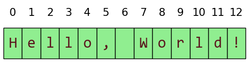

### Зверніть увагу на малюнок: з індексом 5 у нас кома , і вона не була включена у зріз.

### Візьмемо список чисел від 1 до 10 і збережемо окремо парні, непарні та кратні 3 числа.

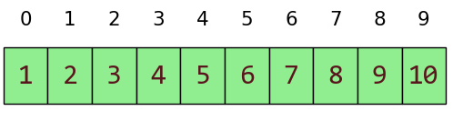

### Спочатку отримаємо непарні числа списку.

numbers = [1, 2, 3, 4, 5, 6, 7, 8, 9, 10]
odd_numbers = numbers[0:10:2]

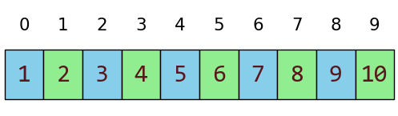

### У списку odd_numbers ми беремо числа (на малюнку синього кольору), починаючи з індексу 0 до 10 з кроком 2, отримаємо новий список [1, 3, 5, 7, 9]. Оскільки ми хочемо включити в перебори списку і десяте число (яке має індекс 9), нам слід використати саме запис numbers[0:10:2].

### За замовчуванням Python розпочне зріз із початку і до кінця списку, тому ми могли б скоротити запис зрізу до виразу:

odd_numbers = numbers[::2]  # Виведе [1, 3, 5, 7, 9]

### Це те ж саме, що і запис numbers[0:10:2].

### Тепер отримаємо парні числа зі списку за допомогою зрізів.

numbers = [1, 2, 3, 4, 5, 6, 7, 8, 9, 10]
even_numbers = numbers[1:10:2]

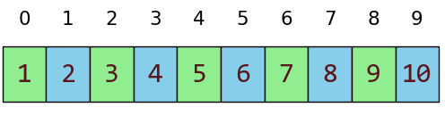

### У even_numbers ми беремо числа, починаючи з індексу 1 до 10 з кроком 2, та отримаємо список [2, 4, 6, 8, 10]. Тут теж можна скоротити запис зрізу та записати.

even_numbers = numbers[1::2] # Виведе [2, 4, 6, 8, 10]

### І нарешті отримаємо числа списку, кратні трьом.

numbers = [1, 2, 3, 4, 5, 6, 7, 8, 9, 10]
three_numbers = numbers[2:10:3]

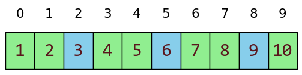

### У three_numbers ми беремо числа, починаючи з індексу 2 до 10 з кроком 3, та отримуємо список [3, 6, 9]. Скорочений запис — three_numbers = numbers[2::3].
### Ми можемо використовувати від'ємні індекси у зрізах. Із корисного, використання від'ємного кроку дозволяє "проходити" послідовність у зворотному порядку і фактично заміняє метод reverse для списків.

numbers = [1, 2, 3, 4, 5, 6, 7, 8, 9, 10]
reverse_numbers = numbers[::-1]
print(reverse_numbers)

### Змінна reverse_numbers буде зберігати зворотний список [10, 9, 8, 7, 6, 5, 4, 3, 2, 1]
### Щоб зробити копію списку в Python, можна замість методу copy використати зріз з усіма елементами оригінального списку. 
### Зробити це дуже просто — треба створити зріз, який починається з першого елемента і йде до кінця списку. Ось як це виглядає на практиці:

numbers = [1, 2, 3, 4, 5, 6, 7, 8, 9, 10]
copy_numbers = numbers[:]
print(copy_numbers)

### У цьому випадку copy_numbers є повною копією numbers. Зріз [:] вказує на вибір усіх елементів зі списку, починаючи з першого і закінчуючи останнім. Це створює новий список, який містить усі елементи оригінального списку, але є незалежним об'єктом. Якщо ти зміниш copy_numbers, це не вплине на numbers, і навпаки.

### Зрізи — це надзвичайно корисний інструмент для роботи з послідовностями в Python, вони дозволяють легко й інтуїтивно отримувати підпослідовності або змінювати порядок елементів.

# Кінець першого модулю

# Модуль 2. Контроль потоку та функції

## Умовні оператори, цикли

### За замовчуванням у Python інструкції виконуються одна за одною зверху вниз. Послідовність виконання виразів у програмі називається «потік виконання» (Flow of execution).
### У Python існує три способи управління потоком виконання:

### умовне виконання — виконання блоку інструкцій тільки за деякої умови;
### цикли — повторення виконання блоку інструкцій, доки виконується деяка умова;
### винятки — механізм обробки помилок, що дозволяє керувати потоком програми при виникненні виняткових ситуацій (наприклад, помилок або інших непередбачених обставин).

### У Python умовне виконання, цикли та винятки формують основу управління потоком виконання програми, дозволяючи розробляти складні та гнучкі алгоритми обробки даних і взаємодії з користувачем.
### Умовний оператор в Python - це конструкція мови, яка дозволяє виконувати певні дії в залежності від того, чи виконується певна умова.
### Умовний оператор у Python має такий синтаксис:

if <умова>:
    <тіло if-блоку>
else:
    <тіло else-блоку>

### if <умова>: вираз, який повертає True або False
### <тіло if-блоку> це набір інструкцій, які виконуються, якщо умова є True
### <тіло else-блоку> це набір інструкцій, які виконуються, якщо умова є False. Блок else є необов'язковим і може бути опущеним.

### На рисунку нижче ми бачимо, що виконання коду відрізняється, якщо значення змінної num є більшим, або меншим за 10.

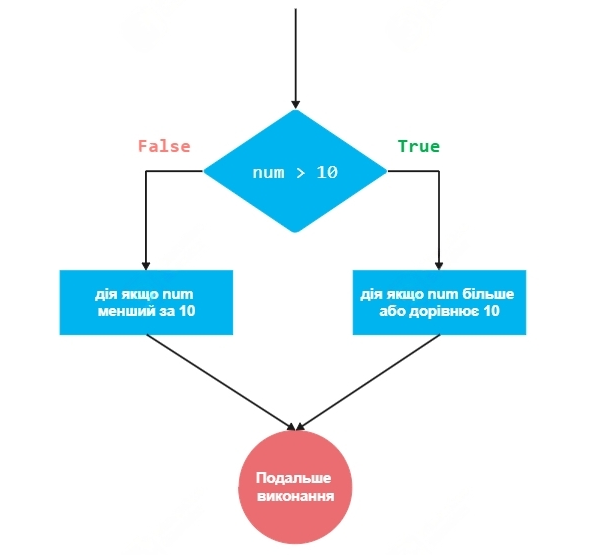

num = 15  # приклад значення для num

if num > 10:
    print("num більше за 10")
else:
    print("num не більше за 10")

### Спочатку ми задаємо значення змінної num. Це може бути будь-яке значення для перевірки різних умов. Потім використовуємо умовний оператор if для перевірки, чи num більше за 10. Якщо умова num > 10 правильна, виконується код усередині блоку if і на екран виводиться повідомлення "num більше за 10". Якщо умова не правильна, виконується код усередині блоку else, і на екран виводиться повідомлення "num не більше за 10".

### Наприклад, розглянемо наступний код, який визначає, що число x є парним:

x = int(input('Введіть число: '))

if x % 2 == 0:
    print("Число x є парним.")
else:
    print("Число x є непарним.")

### У цьому коді <умова> є x % 2 == 0. Якщо ця умова є істинною, тобто число x є парним, виводиться повідомлення "Число x є парним.". 
### Якщо умова є хибною, тобто число x є непарним), виводиться повідомлення "Число x є непарним.".
### Що робити, якщо в нас є низка умов? Для цього у Python реалізований оператор контролю виконання if ... elif ... else. 
### Оператор контролю виконання дозволяє виконувати блоки інструкцій не завжди, а тільки тоді, коли буде виконана умова.

### Синтаксис умовного оператора:

### починається з ключового слова if, за яким йде умова;
### після умови ставиться двокрапка і з нового рядка з відступом йде блок інструкцій, які будуть виконані, якщо умова виконується;
### після блоку if може бути нуль або більше блоків elif, інтерпретатор послідовно перевірятиме усі умови elif зверху вниз, доки не знайде той, який виконується;
### потім може бути один блок else, який виконується, якщо всі попередні умови не виконуються.

a = input('Введіть число')
a = int(a)
if a > 0:
    print('Число додатне')
elif a < 0:
    print("Число від'ємне")
else:
    print('Це число - нуль')

### Під час виконання умовного оператора інтерпретатор Python перевіряє умови зверху вниз, доки не знайде те, яке виконується, потім виконає вираз для цієї умови та вийде з перевірки умов.
### Але будьте уважні, бо досить легко в такому операторі зробити помилку. Подивіться на цей код нижче та визначте, що з ним не так?

a = input('Введіть число')
a = int(a)

if a > 0:
    print('Число додатне')
elif a == 1:
    print('Число дорівнює 1')
else:
    print("a <= 0")

### Подивились? Основна проблема цього коду полягає в тому, що перевірка elif a == 1: є надмірною та ніколи не виконується, оскільки умова if a > 0: вже включає в себе випадок, коли a дорівнює 1. 
### Якщо a дорівнює 1, то програма виведе 'Число додатне', а не 'Число дорівнює 1', як це могло б здатися. Отже цей рядок коду ніколи не буде виконаний, оскільки будь-яке число, рівне 1, вже задовольнить попередню умову a > 0. Це досить поширена помилка новачків програмування у розумінні логіки умовних операторів.

### Виправлений варіант цього коду міг би виглядати так:

a = input('Введіть число')
a = int(a)

if a == 1:
    print('Число дорівнює 1')
elif a > 0:
    print('Число додатне')
else:
    print("a <= 0")

### У цьому випадку перевірка на рівність 1 виконується першою, тому логіка коду стала правильною.

## Логічні вирази
### Умовний оператор if ... elif ... else у Python як умови може приймати змінні типу bool або будь-який вираз, який він виконає і результат перетворить в bool. Коли як умову в умовний оператор ми передаємо вираз, то вираз виконається, а результат його виконання буде перетворений в тип bool.

### Для зручності у Python є механізм неявного приведення будь-якого типу до типу bool. Правила приведення до bool достатньо інтуїтивні.
### Правило перше - число 0 приводиться до False (ціле, дійсне або комплексне). Це правило перетворення дуже важливе, оскільки дозволяє використовувати числові змінні безпосередньо в умовних виразах. Наприклад, у коді нижче ми пишемо if money: і якщо money дорівнює 0, умова вважається неправдивою, і виконується код у блоку else.

money = 0
if money:
    print(f"You have {money} on your bank account")
else:
    print("You have no money and no debts")

### Це робить код чистішим і більш зрозумілим, оскільки не потрібно явно порівнювати money == 0, щоб перевірити, чи є гроші.
### Правило друге - значення None приводиться до False. У коді нижче, якщо змінна result має значення None, умова if result: оцінюється як False, тому що None завжди вважається неправдивим (False) у булевому контексті. Таким чином в нас result є None, а значить виконується код у блоку else, і на екран виводиться повідомлення "Result is None, do something".

result = None
if result:
    print(result)
else:
    print("Result is None, do something")

### Правило третє - порожній контейнер, порожній рядок тощо, приводиться до False. Розглянемо для прикладу просту взаємодію з користувачем та умовного виконання.
user_name = input("Enter your name: ")

if user_name:
    print(f"Hello {user_name}")
else:
    print("Hi Anonym!")

### Спочатку ми просимо користувача ввести своє ім'я за допомогою функції input(), і результат цього вводу зберігається у змінній user_name.

user_name = input("Enter your name: ")

### Потім відбувається перевірка умови за допомогою оператора if. Умова перевіряє, чи змінна user_name не є порожньою. 
### Якщо користувач ввів ім'я (тобто user_name містить непорожній рядок), умова оцінюється як True, і виконується блок коду після if.

print(f"Hello {user_name}")

### У цьому випадку на екран виводиться привітання з введеним ім'ям. Якщо користувач просто натиснув Enter, не вводячи ім'я, а отже змінна user_name є порожнім рядком, умова оцінюється як False, і виконується блок коду після else. У цьому випадку на екран виводиться привітання "Hi Anonym!".

### Правило останнє - все інше приводиться до True

### Ці правила приведення до bool дозволяють писати умовні вирази у Python практично літературною англійською. В будь-якому разі, такий код стає дуже зрозумілим.

## Оператор Is

### Оператор is у Python використовується для перевірки того, чи два об'єкти вказують на одну і ту ж область пам'яті, тобто чи вони є одним і тим же об'єктом.

### Цей оператор відрізняється від оператора ==, який перевіряє рівність значень об'єктів.

### Оператор is у Python використовується для перевірки ідентичності об'єктів, тобто для встановлення, чи дві змінні вказують на один і той самий об'єкт в пам'яті. Цей оператор, який часто називають оператором ідентичності, має особливе значення при роботі з незмінними типами даних, такими як числа та рядки. У випадку з незмінними типами даних Python може кешувати об'єкти, що іноді призводить до того, що оператор is повертає True для об'єктів з однаковими значеннями, як у випадку з дуже малими цілими числами або короткими рядками. Корисно мати цю інформацію для випадку, якщо ви зіткнетеся з таким винятком у своєму коді.

a = [1, 2, 3]
b = a
c = [1, 2, 3]

print(a is b)  # True
print(a is c)  # False

### У цьому прикладі, b є тим самим об'єктом, що й a, тому що вони вказують на один і той же список. Натомість c створює новий список, який містить ті самі значення, але фізично є окремим об'єктом.
### Однак основне його застосування - це перевірка, чи змінна є None.

if my_var is None:
    # Робимо щось, якщо 'my_var' є 'None'

### Таке використання is є оптимальним, оскільки існує лише один об'єкт None у Python.
### Отже, оператор is повинен використовуватися для перевірки ідентичності об'єктів, коли важливо, щоб дві змінні вказували на один і той же об'єкт. 
### А оператор == повинен використовуватися для перевірки рівності значень двох об'єктів.

## Булева алгебра

### Що робити, якщо у нас складна умова, яка поєднує в собі декілька вкладених умов? Наприклад, щоб користувач міг орендувати автомобіль, потрібно, щоб у користувача обов'язково було вказане ім'я, користувач був старший 18 і були водійські права.
### В коді це виглядає наступним чином.

name = "Taras"
age = 22
has_driver_licence = True

if name and age >= 18 and has_driver_licence:
    print(f"User {name} can rent a car")

### Ми бачимо, що тут з'явилися нова операція з and. В Python для побудови логічних умов з декількох, використовується булева алгебра.
### Булева алгебра — це галузь математики, яка займається вивченням істинності виразів та їх обробкою. Вона названа на честь Джорджа Буля, англійського математика, який зробив значний внесок у цю область. Булева алгебра стала фундаментом для розвитку цифрової логіки та комп'ютерних наук.

### У найпростішій формі булева алгебра оперує з двома значеннями: True (істина) і False (неправда). Тому у програмуванні застосовують бінарну логіку, де можливі значення також можуть бути True та False.
### Булева алгебра будується на трьох основних операціях: "і", "або", "ні".

### Існують ще допоміжні операції, але ми розглянемо основні.

### Основні операції в булевій алгебрі включають:

### AND (і): Операція повертає True, якщо обидва операнди є True. Наприклад, True AND True є True, в той час як True AND False є False.
### OR (або): Операція повертає True, якщо хоча б один з операндів є True. Наприклад, True OR False є True.
### NOT (ні): Унарна операція, яка інвертує значення; True стає False, а False стає True.

### У Python оператори булевої алгебри — це оператори not, and, or. 
### Булева алгебра є ключовою для умовних операторів та логічних умов в програмуванні. Вона дозволяє контролювати потік виконання програми (наприклад, за допомогою if-else умов в Python) та виконувати складні логічні перевірки.

### Наприклад, нам треба визначити, чи введене користувачем число є парним двозначним числом:

num = int(input("Введіть число: "))

length = len(str(num))

if length == 2 and num % 2 == 0:
    print("Парне двозначне число")
else:
    print("Ні")

### Змінна length = len(str(num)) перетворює число в рядок str(num) і обчислює його довжину за допомогою функції len(). Ця довжина використовується для перевірки, чи число є двозначним.
### Далі умова if length == 2 and num % 2 == 0: перевіряє дві речі. Чи довжина числа length дорівнює 2 та чи число num є парним. Якщо обидві умови правильні, виводиться повідомлення "Парне двозначне число". 
### Якщо умова в if не виконується, тобто число не є парним двозначним, виконується код після else, і виводиться повідомлення "Ні".

### У булевій алгебрі також важливі поняття булевої функції та булевих таблиць істинності, які використовуються для опису та аналізу логічних операцій. 
### Булеві оператори в Python, такі як and, or, і not, є основними інструментами для побудови складних логічних умов. Вони використовуються для оцінки істинності або неправдивості виразів та є ключовими у процесі прийняття рішень у програмах.

## Оператор and (I)

### Оператор and використовується для перевірки, чи обидві умови є істинними. Вираз з and вважається True тільки тоді, коли обидва операнди істинні.
### Наприклад:

a = True and False  # False

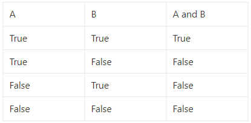

### Ця таблиця показує, що вираз A and B буде істинним тільки тоді, коли обидва операнди A і B істинні.

### Оператор or (або)

### Оператор or перевіряє, чи хоча б одна з умов є істинною. Вираз із or вважається True, якщо принаймні один із операндів є істинним:

 a = True or False  # True

### Таблиця істинності для or:

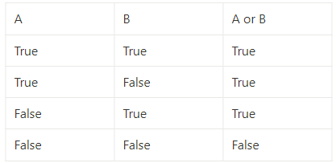

### З таблиці видно, що вираз A or B є істинним у всіх випадках, крім випадку, коли обидва операнди є неправдивими.

## Оператор not (ні)

### Оператор not використовується для інвертування істинності операнду. Якщо операнд істинний, not перетворює його на неправдивий, і навпаки:

a = not 2 < 0  # True

### У цьому прикладі, оскільки 2 < 0 є неправдивим (False), оператор not перетворює його на True.
### Таблиця істинності для not:

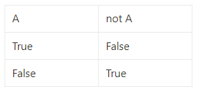

### На останок розглянемо завдання "FizzBuzz”. Завдання часто зустрічається на співбесідах з програмування. Його суть полягає в написанні програми, яка для заданого числа:

### Виводить "Fizz", якщо число кратне якомусь певному числу (наприклад, 3);
### Виводить "Buzz", якщо число кратне іншому певному числу (наприклад, 5);
### Виводить "FizzBuzz", якщо число кратне обом цим числам;
### В іншому випадку виводить саме число.

### На перший погляд це досить проста задача, але навіть досвідчені програмісти можуть тут помилитися. 
### Задача "FizzBuzz" часто вважається базовим тестом на здатність кандидата розуміти та застосовувати основні концепції програмування. Хоча вона може здатися простою, її ефективне вирішення вимагає злагодженого застосування декількох основних програмувальних принципів.

### Задаємо конкретне число
num = int(input())

### Перевіряємо кратність
if num % 3 == 0 and num % 5 == 0:
    print("FizzBuzz")
elif num % 3 == 0:
    print("Fizz")
elif num % 5 == 0:
    print("Buzz")
else:
    print(num)

### Умова if num % 3 == 0 and num % 5 == 0 перевіряє, чи введене число кратне і 3, і 5 одночасно. Ця перевірка стоїть першою, оскільки вона є найспецифічнішою.
### Якщо ця умова виконується, виводиться "FizzBuzz". Якби ця перевірка була після інших, вона б ніколи не виконувалася, тому що більш загальні умови (кратність 3 або 5) вже б були виконані. 
### Далі elif num % 3 == 0 перевіряє, чи число кратне тільки 3. Ця умова виконується тільки якщо попередня умова (кратність і 3, і 5) не виконалася. 
### Якщо це правда, виводиться "Fizz". Умова elif num % 5 == 0 перевіряє, чи число кратне тільки 5. Як і попередня, ця умова виконується лише тоді, коли попередні перевірки не виявилися істинними. 
### У випадку виконання цієї умови виводиться "Buzz". Якщо жодна з вищезазначених умов не виконалася, то else гарантує, що буде виведене саме число.

### Порядок цих умов є ключовим, бо він забезпечує, що найспецифічніша перевірка - кратність і 3, і 5 має пріоритет, а потім перевіряються менш специфічні випадки - кратність окремо 3 або 5. 
### Це запобігає випадкам, коли числа, які кратні і 3, і 5, були б неправильно оброблені через виконання менш специфічних умов.

## Блоки інструкцій та тернарні оператори
### У Python особливий синтаксис стосовно виділення блоків інструкцій. Щоб інтерпретатор сприйняв набір інструкцій як окремий блок, достатньо виділити всі інструкції цього блоку однаковою кількістю відступів зліва. 
### У Python рекомендується для виділення одного рівня вкладеності для блоку інструкцій використовувати 4 пробіли.

x = int(input("X: "))
y = int(input("Y: "))

if x == 0:
    print("X can`t be equal to zero")
    x = int(input("X: "))

result = y / x

### Ви можете використати символи табуляції для виділення блоку інструкцій, це не помилка, але такий спосіб не рекомендується.
### Синтаксичною помилкою буде змішати в одному файлі виділення блоків за допомогою табуляцій та пробілів одночасно, пам'ятайте про це.
### Також можна виділяти декілька рівнів вкладеності, додаючи ще 4 пробіли зліва для всіх інструкцій блоку:

x = int(input("X: "))
y = int(input("Y: "))

if x == 0:
    print("X can`t be equal to zero")
    x = int(input("X: "))

    if x == 0:
        print("X can`t be equal to zero")
        x = int(input("X: "))

        if x == 0:
            print("X can`t be equal to zero")
            x = int(input("X: "))

result = y / x

### В цьому прикладі тричі повторюється перевірка на нерівність x нулю, і на кожну перевірку блок інструкцій виділяється додатковими 4-ма пробілами. Сенсу в додаткових перевірках немає, це зроблено тільки заради демонстрації.
### Наведемо наступний приклад вкладеності для визначення чвертей для координатної площини, щоб закріпити розуміння блоку інструкцій. Даний фрагмент коду реалізує визначення квадранту точки з координатами x та y на координатній площині.

if x >= 0:
    if y >= 0:  # x > 0, y > 0
        print("Перша чверть")
    else:  # x > 0, y < 0
        print("Четверта чверть")
else:
    if y >= 0:  # x < 0, y > 0
        print("Друга чверть")
    else:  # x < 0, y < 0
        print("Третя чверть")

### Тернарні операції

### Тернарні оператори в Python є елегантним способом вираження умовних виразів у скороченій формі. Вони дозволяють вам вибирати між двома значеннями залежно від того, чи є певна умова істинною або неправдивою. 
### Це робить код компактнішим і часто полегшує його читання.
### У прикладі нижче, вираз state = "nice" if is_nice else "not nice" використовує тернарний оператор для присвоєння рядка "nice" змінній state, якщо is_nice є істинним True, і рядка "not nice", якщо is_nice є неправдивим False:

is_nice = True
state = "nice" 
if is_nice else "not nice"

### У цьому прикладі значенням змінної state буде рядок 'nice'.
### Такий підхід дозволяє швидко перевірити умову, а не писати декілька рядків оператора if ... else .... Для порівняння, ось як виглядав би той самий вираз без використання тернарного оператора, а з використанням стандартного блоку if-else:

is_nice = True
if is_nice:
    state = "nice"
else:
    state = "not nice"

### Ця версія коду робить те саме, що й тернарний оператор, але займає більше місця і є менш компактною.
### Ще одним корисним варіантом тернарного оператора в Python є використання оператора or для швидкого визначення значення.

some_data = None
msg = some_data or "Не було повернено даних"

### В прикладі ми присвоїмо msg значення some_data, якщо some_data не є None (або іншим значенням, яке вважається неправдивим у Python, як False, порожній рядок, порожній список тощо). 
### У випадку, якщо some_data є None або неправдивим, msg отримає значення "Не було повернено даних". 
### В нашому випадку msg буде містити рядок 'Не було повернено даних', це зручно, коли потрібно швидко перевірити значення та показати повідомлення, якщо значення some_data є None.

### Без використання скороченої форми тернарного оператора з or, вираз msg = some_data or "Не було повернено даних" може бути переписаний з використанням стандартного умовного оператора if ... else ... наступним чином:

some_data = None
if some_data:
    msg = some_data
else:
    msg = "Не було повернено даних"

### Цей варіант коду, хоч і більш довгий і менш компактний, може бути більш зрозумілим для новачків або у випадках, коли потрібна більш чітка логіка умови.

### Зверніть увагу, що для скороченої форми використовується саме оператор or (АБО).

## Оператор match

### Оператор match, введений у Python починаючи з версії 3.10, є схожим на оператори switch-case в інших мовах програмування. 
### Він дозволяє порівнювати значення з декількома шаблонами і виконувати різні блоки коду в залежності від того, який шаблон відповідає значенню.

### Структура оператора match:

match змінна:
    case шаблон1:
        # виконати код для шаблону 1
    case шаблон2:
        # виконати код для шаблону 2
    case _:
        # виконати код, якщо не знайдено відповідностей

### Оператор match - це свого роду розширена і більш гнучка версія оператора if-elif-else. Він дозволяє порівнювати значення з рядом шаблонів і, залежно від відповідності, виконувати певні дії.

fruit = "apple"

match fruit:
    case "apple":
        print("This is an apple.")
    case "banana":
        print("This is a banana.")
    case "orange":
        print("This is an orange.")
    case _:
        print("Unknown fruit.")

### У прикладі fruit - це змінна, значення якої ми хочемо перевірити:
fruit = "apple"

### Далі оператор match порівнює значення змінної fruit з кожним значенням case послідовно. Якщо fruit дорівнює "apple", то виконується блок коду під case "apple":, і на екран виводиться "This is an apple."

case "apple":
    print("This is an apple.")

### Якщо fruit дорівнює "banana", то виведеться "This is a banana.", і так далі для "orange". Але якщо жоден з варіантів не відповідає значенням case (тобто fruit не є ні "apple", ні "banana", ні "orange"), то виконується блок коду під case _:.
### Символ _ тут використовується як "заглушка" для вказівки на будь-які інші випадки, які не відповідають переліченим. У цьому випадку на екран виведеться "Unknown fruit.".

case _:
    print("Unknown fruit.")

### Цей оператор був введений для випадків, коли нам потрібно виконати різні дії в залежності від значення однієї змінної, особливо коли таких варіантів багато. Раніше для цього ми використовували довгий ланцюжок if-elif-else, але тепер оператор match робить код чистішим та простішим для розуміння.

### Але оператор має більш розширену сферу використання. Наприклад використання змінних у шаблонах. Розглянемо приклад:

point = (1, 0)

match point:
    case (0, 0):
        print("Точка в центрі координат")  
    case (0, y):
        print(f"Точка лежить на осі Y: y={y}")  
    case (x, 0):
        print(f"Точка лежить на осі X: x={x}") 
    case (x, y):
        print(f"Точка має координати:  x={x}, y={y}") 
    case _:
        print("Це не точка")

### Якщо значення point = (1, 0) то спрацює case (x, 0): і ми отримаємо виведення Точка лежить на осі X: x=1. Якщо значення point = (1, 1) то спрацює вже case (x, y): та буде вивід "Точка має координати: x=1, y=1". В прикладі використовується match для порівняння point з декількома шаблонами. Якщо point відповідає одному з цих шаблонів, виконується відповідний блок коду.

### Також можна використовувати оператор match з колекціями. Наприклад ми маємо список pets, який містить назви домашніх тварин.

pets = ["dog", "fish", "cat"]

match pets:
    case ["dog", "cat", _]:
        # Випадок, коли є і собака, і кіт
        print("There's a dog and a cat.")
    case ["dog", _, _]:
        # Випадок, коли є тільки собака
        print("There's a dog.")
    case _:
        # Випадок для інших комбінацій
        print("No dogs.")

### В цьому випадку виведення буде "There's a dog.", бо тільки "dog" знаходиться на своєму місці. Тут match використовується для перевірки, чи містить список pets певні комбінації тварин. Причому важливо, що саме комбінації, і саме тому в нас спрацював case ["dog", _, _]:, а не case ["dog", "cat", _]:, бо cat в списку pets знаходиться в кінці, а не після dog. Знак _ в шаблоні використовується як "заповнювач", що означає "будь-яке інше значення".

## Цикли
### Для того, щоб повторити якийсь блок коду кілька разів або повторювати, доки виконується деяка умова, у Python реалізовані цикли. Вони є фундаментальною конструкцією, яка дозволяє повторювати виконання певного блоку коду кілька разів.
### Існують два основних типи циклів: for та while.:

### Цикл for в Python використовується для ітерації по елементах будь-якої послідовності (наприклад, списку, кортежу, рядка) або інших ітерованих об'єктів;

for element in sequence:
    # виконувати дії з element

### Цикл while виконує блок коду, поки задана умова є істинною (True). Як тільки умова стає неправдивою (False), цикл закінчується.

while condition:
    # виконувати дії, поки condition є True

### Ітерація (лат. iteratio «повторювання») — повторювання будь-якої дії. 
### Ітерація у програмуванні — організація обробки даних, за якої дії повторюються багаторазово, не призводячи, при цьому, до викликів самих себе. Одна ітерація — це одне повторювання.

## Цикл For

### У Python цикл for використовується для перебору усіх елементів контейнерів або ітерованих об'єктів, наприклад, списків. 
### Інструкції, які знаходяться у тілі циклу, будуть виконані стільки разів, скільки елементів у колекції.
### При цьому на кожній ітерації спеціальна змінна набуває значення одного з елементів колекції.
### Роботу циклу for можна порівняти з тим, що ви по черзі візьмете кожну літеру з фрази й промовите її. Фразою може виступати рядок 'apple', а аналогом вимовлення вголос буде виступати виведення відповідної літери в консоль.

fruit = 'apple'
for char in fruit:
    print(char)

### У результаті виконання цього коду ви побачите в консолі:
a
p
p
l
e

### Синтаксис циклу for в Python включає кілька важливих компонентів:

### Цикл починається з ключового слова for, що вказує на початок циклу.
### Після for слідує назва змінної, яка буде використовуватися для зберігання поточного значення ітерації. Значення цієї змінної буде змінюватися з кожною ітерацією циклу.
### Далі йде ключове слово in, що вказує на об'єкт або діапазон, по якому буде відбуватися ітерація.
### Після in розміщується об'єкт або вираз, що визначає набір елементів або діапазон, по якому буде відбуватися ітерація.
### В кінці рядка ставиться двокрапка :, що відділяє заголовок циклу від його тіла.
### На новому рядку з відступом від початку рядка розміщуються інструкції або вирази, які потрібно виконувати на кожній ітерації. Відступ є обов'язковим, оскільки він визначає блок коду, який належить до циклу.

### Розглянемо декілька прикладів, щоб краще розуміти як працює цикл for. По будь-якій колекції можна пройти за допомогою циклу for і на кожній ітерації в циклі буде отримано один з елементів цієї колекції.

alphabet = "abcdefghijklmnopqrstuvwxyz"
for char in alphabet:
    print(char, end=" ")

### У прикладі літери алфавіту з alphabet виводяться в консоль по черзі, через пробіл.
 a b c d e f g h i j k l m n o p q r s t u v w x y z

### Використаємо цикл for у Python для ітерації по елементах ітерованого об'єкта, у нашому випадку — списку some_iterable.

some_iterable = ["a", "b", "c"]

for i in some_iterable:
    print(i)

### У консолі ми побачимо:
a
b
c

### Цикл for використовується для послідовного проходження по кожному елементу списку some_iterable. 
### В цьому циклі i є змінною, яка на кожній ітерації приймає значення поточного елемента з some_iterable. На кожній ітерації виконується команда print(i), яка виводить поточний елемент списку.

### Цикл for може використовуватися для перебору всіх чисел у списку та отримання результату для кожного числа:

odd_numbers = [1, 3, 5, 7, 9]
for i in odd_numbers:
    print(i ** 2)

### Код з цього прикладу виведе в консоль квадрати чисел списку odd_numbers.
1
9
25
49
81

### Розглянемо наступну задачу. Користувач вводить рядок. Треба порахувати скільки символів в рядку та скільки пробілів в рядку. Як ми можемо написати код?
### Ми повинні скласти порядок дій для розв'язання цієї задачі:

### Зчитування рядка від користувача.
### Використання циклу for для перебору кожного символу в рядку.
### Підрахунок загальної кількості символів та окремо кількості пробілів за допомоги циклу for та оператору if.

### Ось приклад коду на Python, який реалізує цю логіку:

Зчитування рядка від користувача
user_input = input("Введіть рядок: ")

Ініціалізація змінних для підрахунку символів та пробілів

total_chars = len(user_input)  # загальна кількість символів у рядку
space_count = 0  # кількість пробілів

Підрахунок кількості пробілів

for char in user_input:
    if char == " ":
        space_count += 1

Виведення результатів

print(f"Загальна кількість символів у рядку: {total_chars}")
print(f"Кількість пробілів у рядку: {space_count}")

### У цьому коді вираз len(user_input) використовується для підрахунку загальної кількості символів у введеному рядку. Цикл for проходить через кожен символ у рядку, і якщо символ є пробілом, умова char == " ", змінна space_count інкрементується (збільшується) на 1. В кінці, виводяться обидва результати - це загальна кількість символів та кількість пробілів.

## Цикл While

### Цикл while у Python — це один із способів організації циклічного виконання коду. Він продовжує виконувати блок інструкцій, поки задана умова залишається істинною. Цикл while часто використовується, коли кількість ітерацій заздалегідь невідома або коли ітерації залежать від змінних, які можуть бути модифіковані в процесі виконання циклу.

### Синтаксис циклу while наступний:

while condition:
    # Блок коду для виконання

### condition (умова) — це логічний вираз, який перевіряється перед кожною ітерацією циклу. Якщо умова істинна True, код усередині блоку while виконується. Як тільки умова стає неправдивою False, виконання циклу припиняється.

### Розглянемо приклад:

k = 0
while k < 10:
    k = k + 1
	print(k)

### У цьому прикладі, цикл while виконуватиметься, поки змінна k менша за 10. На кожній ітерації k збільшується на 1, і виводиться значення k. Коли змінна k досягає значення 10, умова k < 10 стає неправдивою, і цикл припиняється.

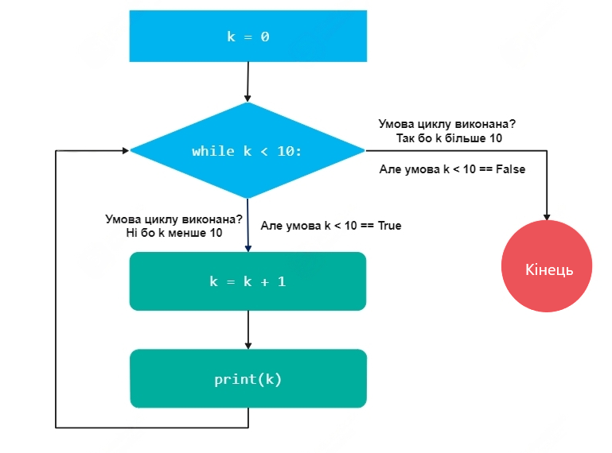

### При використанні циклів while важливо забезпечити, що умова циклу змінюватиметься в процесі його виконання, щоб уникнути нескінченних циклів.

## «Нескінченні цикли» та break

### Бувають ситуації, коли необхідно вийти з циклу до завершення ітерації, не дочекавшись, доки станеться чергова перевірка умови. Для цього є команда break. Команда break зупиняє цикл в момент виклику і не завершує ітерацію.

a = 0
while True:
    print(a)
    if a >= 20:
        break
    a = a + 1

### В цьому прикладі умова циклу буде виконуватися завжди, адже True завжди буде True. Це приклад нескінченного циклу. Але через перевірку, що a >= 20, цей цикл завершиться, щойно в a буде значення 20 або більше.
### Нескінченні цикли часто застосовуються там, де потрібно взаємодіяти з клієнтом, чекаючи введення від нього, і завершується тільки при настанні деякої умови.
### Наприклад echo скрипт, який виводить в консоль те, що ви введете, доки ви не введете рядок тексту exit:

while True:
    user_input = input()
    print(user_input)
    if user_input == "exit":
        break

## Завершення ітерації за допомогою continue

### Також для того, аби одразу перейти до наступної ітерації циклу без виконання виразів, що залишилися, є команда continue. 
### Виклик цієї команди у тілі циклу призводить до того, що вирази цієї ітерації, що залишилися, не будуть виконані, а інтерпретатор одразу перейде до наступної ітерації або перевірки умови.

a = 0
while a < 6:
    a = a + 1
    if not a % 2:
        continue
    print(a)

### У консолі ви побачите: 
1
3
5

### Інструкція print(a) не виконувалась, коли a ділилося на 2 без залишку, оскільки ітерація завершувалася за допомогою continue.
### В цьому прикладі використовувався оператор отримання залишку від ділення %, він повертає таке число p, що якщо його відняти від r, то результат буде ділитися на x націло: (r - p) / x = a, де а, x, r — цілі числа.

for i in range(1, 10):
    if i % 2 == 0:
        print(f”{i} є парним числом.“)
    else:
        print(f”{i} є непарним числом.“)

### Оператори continue та break працюють тільки всередині одного циклу. В ситуації вкладених циклів немає способу вийти з усіх циклів одразу.

while True:
    number = input("number = ")
    number = int(number)
    while True:
        print(number)
        number = number - 1
        if number < 0:
            break

### В цьому прикладі користувач вводить число та отримує зворотний відлік від цього числа до 0 в консолі. При цьому, зовнішній нескінченний цикл жодним чином не перервати і break вийде тільки з внутрішнього циклу.
### Також використання continue або break поза циклом призводить до синтаксичної помилки.

number = int(input("number = "))
if number < 0:
    break

### Такий код призводить до помилки SyntaxError. Такі помилки називаються винятками.

## Розширення можливостей циклу for

### Зараз ми розглянемо три ключові функції Python, які забезпечують потужні і гнучкі способи для ітерації, або повторення певних дій: range, enumerate та zip.

### Ці функції є фундаментальними для ефективного використання циклів for та відіграють важливу роль у різноманітних програмувальних задачах. Розуміння та застосування цих функцій допоможе підвищити ефективність нашого коду.

### Функція range важлива для створення послідовностей чисел, які ви можете використовувати у циклах. Вона надзвичайно корисна, коли вам потрібно виконати дію певну кількість разів або ітерувати через послідовність чисел.

### Коли вам потрібно отримати доступ не тільки до значення з ітерованої колекції, але до її індексу, тут функція enumerate стає незамінним помічником. 
### Ця функція дозволяє вам легко отримувати доступ до індексу кожного елементу під час ітерації.

### Функція zip використовується для одночасної ітерації по кількох колекціях. 
### Якщо вам потрібно комбінувати дані з різних джерел або виконувати операції, які залежать від декількох пов'язаних колекцій, zip дозволяє це зробити легко та елегантно.

### Розглянувши кожну з цих функцій, ми зможемо значно розширити свої навички роботи з циклами та колекціями в Python, створюючи більш потужний та виразний код.

## Фунція Range

### Функція range у поєднанні з циклом for у Python є потужним інструментом для контролю повторення дій певну кількість разів. Цей механізм часто використовується для ітерації через послідовність чисел, що робить його особливо корисним для різних задач, від базових до складних алгоритмів.

### Функція range створює послідовність чисел. Вона може бути використана різними способами:

range(stop): Створює послідовність чисел від 0 до stop - 1.
range(start, stop): Генерує числа від start до stop - 1.
range(start, stop, step): Створює числа від start до stop - 1, з кроком step.

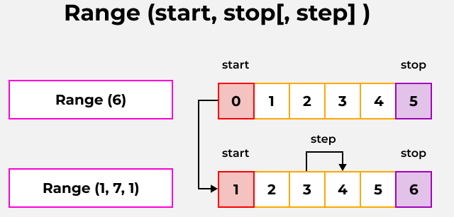

### Цей приклад використовує цикл for разом з range для ітерації через послідовність чисел.

for i in range(5):
    print(i)

### У цьому прикладі range(5) генерує послідовність чисел від 0 до 4. Цикл for проходиться по цій послідовності, і змінна i приймає значення кожного числа в послідовності по черзі. Це був приклад простої ітерації.
### Ітерація з визначеним початком і кінцем ітерації. Приклад виведення чисел від 2 до 9.

for i in range(2, 10):
    print(i)

### Ітерація з кроком. Цей приклад виведе парні числа від 0 до 8.

for i in range(0, 10, 2):
    print(i)

### Функція range разом з циклом for є основою для структурованого повторення коду та важливою частиною багатьох алгоритмів і програм у Python. 
### Вони дають можливість легко маніпулювати послідовностями чисел для вирішення різноманітних задач.

## Функція Enumerate

### Функція enumerate використовується для одночасного отримання індексу та значення елементів ітерованого об'єкта. Це корисно, коли вам потрібно отримати доступ до індексу елементів під час ітерації.

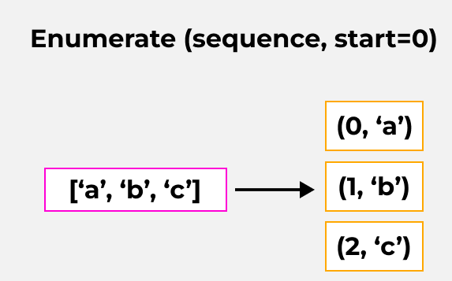

some_list = ["apple", "banana", "cherry"]
for index, value in enumerate(some_list):
    print(index, value)

### У цьому прикладі enumerate(some_list) створює пари індекс-значення для кожного елемента в списку, і цикл for проходить по цих парах.

### Виведення:
0 apple
1 banana
2 cherry

## Функція Zip

### Функція zip використовується для ітерації по декількох ітерованих об'єктах одночасно. 
### Вона "застібає" елементи з кожного ітерованого об'єкта, створюючи кортежі з цих елементів.

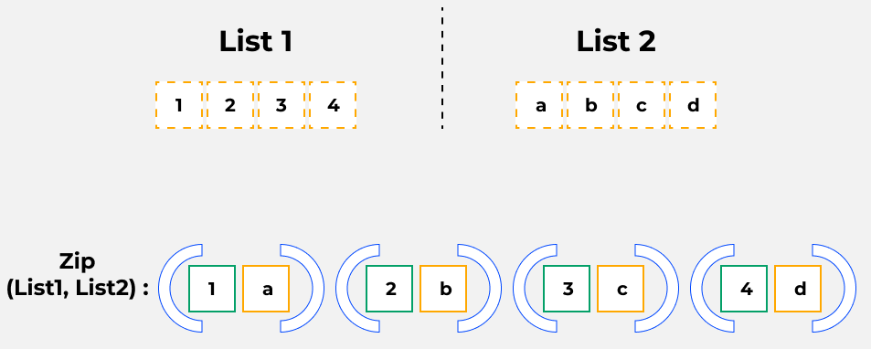

### У цьому випадку zip(list1, list2) об'єднує елементи з list1 та list2, і цикл for проходить по створеним словосполученням.

### Виведення:

зелене яблуко
стигла вишня
червоний томат

### Коли колекції, передані в zip, мають різну довжину, zip обробляє елементи до тих пір, поки не закінчаться елементи в найкоротшій колекції. 
### Це означає, що ітерація припиняється, як тільки буде досягнутий кінець однієї з колекцій, і будь-які додаткові елементи в інших, більш довгих колекціях, ігноруються.

list1 = [1, 2, 3]
list2 = ['a', 'b', 'c', 'd', 'e']

for number, letter in zip(list1, list2):
    print(number, letter)

### У цьому прикладі list1 має 3 елементи, тоді як list2 має 5 елементів. Оскільки list1 є коротшим, zip припинить ітерацію після третьої пари значень. 
### Результат буде:

1 a
2 b
3 c

### Елементи 'd' та 'e' з list2 у цьому випадку будуть проігноровані.
### Тому обережно використовуйте zip з дуже великими колекціями, оскільки надлишкові елементи ігноруються, що може призвести до втрати даних або непередбачених результатів, якщо цей аспект ігнорувати.

## Цикли та словники

### Ітерування за словником — це такий блок коду, який дуже часто зустрічається при програмуванні, тож корисно вміти це робити.
### Спершу варто сказати, що словник сам по собі — це ітерований контейнер і за ним можна ітеруватися в циклі for без необхідності заводити якийсь зовнішній лічильник тощо. 
### Створимо словник, в якому ключами будуть числа, а значеннями — числівники англійською:

numbers = {
    1: "one",
    2: "two",
    3: "three"
}

### Тепер давайте просто пройдемося словником у циклі та подивимося, що саме повертає ітератор на кожній ітерації:
for key in numbers:
    print(key)

### У виведенні ви побачите:
1
2
3

### Під час ітерації по словнику Python за замовчуванням перебирає ключі словника. Це стандартна та найбільш поширена форма запису, яку зазвичай використовують у практичному коді.
### Таку саму поведінку можна отримати, використовуючи метод keys(), якщо потрібно явно вказати, що нас цікавлять саме ключі словника:
numbers = {
    1: "one",
    2: "two",
    3: "three"
}

for key in numbers.keys():
    print(key)

### Результат у цьому випадку буде абсолютно таким самим:
1
2
3

### Метод keys() не змінює логіку роботи циклу і не є обов’язковим. Його використання має сенс лише тоді, коли потрібно підкреслити намір працювати саме з ключами або зберегти узгодженість із методами values() та items().
### У більшості випадків достатньо простішого запису:

for key in numbers:

### Часто необхідно перебрати саме значення словника, для цього скористаємося методом values:

for val in numbers.values():
    print(val)

### У виведенні буде:
one
two
tree

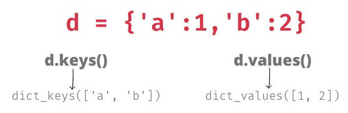

### Щоб перебрати пари ключ значення словника треба використати метод items. На кожній ітерації ми отримаємо пару (ключ, значення):

for key, value in numbers.items():
    print(key, value)

### Виведення:

1 one
2 two
3 three

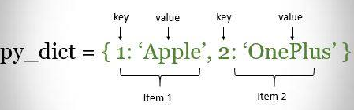

### Важливо пам'ятати, що не можна робити, поки ітеруєтеся за словником: не можна видаляти елементи із словника, не можна додавати елементи у словник. 
### Але можна перезаписувати значення, якщо ви ітеруєтеся за ключами. Теж саме стосуються і списку - не можна видаляти елементи списку та не можна додавати елементи у список під час ітерацій в циклі.

## Винятки

### Перетворити в int або float можна не будь-який рядок. Наприклад, якщо користувач введе 'a', то інтерпретатор не зможе визначити, як перетворити символ a в ціле число, і викличе виняток ValueError.

int("a")
---------------------------------------------------------------------------
ValueError                                Traceback (most recent call last)
<ipython-input-6-d9136db7b558> in <module>
----> 1 int("a")

ValueError: invalid literal for int() with base 10: 'a'

### Виключення у Python — це помилка на рівні інтерпретатора, викликана неможливістю виконати той або інший оператор з будь-яких причин (змінна не існує, синтаксична помилка, відсутній атрибут, операція ділення на нуль тощо).
### У нашому прикладі (ввели 'а') інтерпретатор намагається перетворити рядок в тип int (ціле число), але як перетворити рядок 'a' у число не визначено і буде викликаний виняток із цього приводу.

## Основні типи винятків у Python

### SyntaxError — синтаксична помилка.

### IndentationError — помилка, яка виникає, якщо у виділенні блоків інструкцій пробілами допущена помилка.

### TabError виникає, якщо в одному файлі використовувати пробіли і табуляції для виділення блоків інструкцій.

### TypeError виникає, коли операція зі змінною цього типу неможлива.

2 / 'a'

### ValueError виникає, коли тип операнда відповідний, але значення таке, що операцію неможливо виконати.

int("a")

### ZeroDivisionError — ділення на нуль.

## Механізм обробки винятків

### Для обробки винятків існує оператор try ... except .... Синтаксично цей оператор розпочинається з ключового слова try: (спробувати) та продовжується блоком коду, в якому ми чекаємо, що може статися помилка.
### Далі йде блок обробки винятків except (крім), де можна вказати один або більше винятків. Якщо один із зазначених винятків станеться, то виконається наступний блок коду.
### Цей блок не обов'язковий, але найчастіше потрібний. Він виконається, якщо станеться зазначений виняток (один із них, якщо їх декілька).
### Якщо помилки можуть бути різні і обробляти їх потрібно теж по-різному, то можна додати декілька блоків except, у кожному вказати свою помилку і що робити, якщо вона станеться.
### Потім іде необов'язковий блок, який розпочинається з ключового слова else. Цей код виконається, тільки якщо винятків не сталося.
### Останнім іде необов'язковий блок коду, який розпочинається з ключового слова finally, він виконається у будь-якому разі, незалежно від того, були помилки або ні.

### У нашому прикладі обробка призначеного для користувача введення виглядатиме таким чином:

val = 'a'
try:
    val = int(val)
except ValueError:
    print(f"val {val} is not a number")
else:
    print(val > 0)
finally:
    print("This will be printed anyway")

### Винятки у Python — це дуже потужний інструмент, який часто використовується для управління потоком виконання, а не тільки для обробки помилок. У динамічних мовах ніколи не можна бути на 100% впевненим у тому, що користувач увів значення коректного типу, або що інший застосунок не повернув None замість int, наприклад.

### Наївним розв'язанням цієї проблеми буде повсюдне використання перевірок if на коректність введеного користувачем або іншим застосунком значення. 
### Просунутішим, зручнішим і прозорішим рішенням є використання механізму обробки винятків там, де вони можуть статися через некоректні вхідні дані.

age = input("How old are you? ")
try:
    age = int(age)
    if age >= 18:
        print("You are adult.")
    else:
        print("You are infant")
except ValueError:
    print(f"{age} is not a number")

### Нагадуємо, що f-рядок — це такий шаблон, який дозволяє зручним чином генерувати рядок, підставляючи результат виконання виразів у потрібне місце в шаблоні.

### Функції, область видимості змінних (LEGB)

### Функції – це спосіб групування коду, який виконує певну задачу. 
### Вони дозволяють групувати код так, щоб його можна було викликати кілька разів у програмі без необхідності його повторного написання. 
### Функції допомагають організувати код, роблять його більш читабельним і полегшують подальшу роботу з кодом.

## Створення та виклик функцій
### Функція оголошується за допомогою ключового слова def. Після ключового слова вказується ім'я функції, за яким йде пара дужок (), у яких можна вказати імена деяких змінних, та двокрапка : в кінці рядка. Далі слідує блок команд, що складають функцію. На прикладі можна бачити, що насправді це дуже просто:

def say_hello():
		# тіло функції
    print('Привіт, Світ!')

# Кінець функції say_hello()

# виклик функції
say_hello()

# ще один виклик функції
say_hello()

### Ми визначили функцію з ім'ям say_hello, використовуючи описаний вище синтаксис. Ця функція не приймає параметрів, тому в дужках не оголошені якісь змінні.

## Аргумент функції

### Параметри функції – це деякі вхідні дані, які ми можемо передати функції, щоб отримати результат, що відповідає цим даним.
### Функції можуть приймати параметри, тобто деякі значення, що передаються в середину функції для того, щоб вона щось зробила з ними. 
### Ці параметри схожі на змінні, за виключенням того, що значення цих змінних вказуються при виклику функції та під час роботи функції їм вже присвоєні їх значення.

### Параметри вказуються в дужках при оголошенні функції та розділяються комами. Аналогічно ми передаємо значення, коли викликаємо функцію.
### Зверніть увагу на термінологію: імена, вказані при оголошенні функції, називаються параметрами, тоді як значення, які ви передаєте у функцію при її виклику, – аргументами.

def print_max(a, b):
    if a > b:
        print(a, 'максимально')
    elif a == b:
        print(a, 'дорівнює', b)
    else:
        print(b, 'максимально')

print_max(3, 4)  # пряма передача значень

x = 5
y = 7
print_max(x, y)  # передача змінних як аргументів

### Тут ми визначили функцію з ім'ям print_max, яка використовує два параметри з іменами a та b. 
### Ми знаходимо найбільше число із застосуванням простого оператора if..else та виводимо це число. При першому виклику функції print_max ми напряму передаємо числа як аргументи.

print_max(3, 4)  # пряма передача значень

### У другому випадку ми викликаємо функцію зі змінними як аргументи, print_max(x, y) призначає значення аргументу x параметру a, а значення аргументу y – параметру b.

x = 5
y = 7
print_max(x, y)  # передача змінних як аргументів

### В обох випадках функція print_max працює однаково.

## Типізація параметрів функції

### В Python, починаючи з версії 3.5, ви можете використовувати "type hints" (підказки типів) для вказівки очікуваних типів параметрів. 
### Це дозволяє коду бути більш зрозумілим та може допомогти у виявленні можливих помилок.
### Попередню функцію ми можемо записати тепер наступним чином:

def print_max(a: int, b: int):
    if a > b:
        print(a, 'максимально')
    elif a == b:
        print(a, 'дорівнює', b)
    else:
        print(b, 'максимально')

print_max(3, 4)  # пряма передача значень

x = 5
y = 7
print_max(x, y)  # передача змінних як аргументів

### У цьому прикладі параметри a: int та b: int позначають, що функція print_max очікує два аргументи типу int (цілі числа). Типізація параметрів допоможе нам зробити очікування функції щодо вхідних даних більш явними.
### Типізація в Python є опціональною та не впливає на виконання коду в рантаймі (run-time), але вона може бути корисною для розробників. 
### Це дозволяє легше розуміти код, забезпечує кращу підтримку від редакторів коду, а також полегшує виявлення помилок перед виконанням коду.

## Повернення результату

### У Python немає синтаксичної різниці між функціями і процедурами. 
### По суті, функція вміє повертати деякий результат своєї роботи, а процедура нічого не повертає та результатом її роботи може бути зміна стану змінних, які вже існують. 
### Така форма використання функцій максимально наближена до функцій, з якими ми знайомі з уроків математики.

### Повернення результату з функції в Python виконується за допомогою оператора return. Цей оператор завершує виконання функції та "повертає" значення, яке може бути використане в інших частинах програми. 
### Це особливо корисно для отримання результатів обчислень, обробки даних та інших операцій. В Python ви можете явно вказати тип даних, який повертається функцією, використовуючи анотації типів.
### Базовий синтаксис для повернення значення з функції виглядає наступним чином:

def my_function() -> ReturnType:
    # виконати дії
    return result

### ReturnType вказує на тип даних, який функція має повертати. Це може бути будь-який тип даних, як-от int, float, str, list, dict, або навіть складніші типи, включаючи класи та інтерфейси, що ми побачимо згодом в курсі. 
### Для повернення значення з функції необхідно вказати, що повернути після ключового слова return. Тому result - це значення або змінна, яку функція повертає.
### Розглянемо приклад функції, яка сумує два числа та повертає результат:

def add_numbers(num1: int, num2: int) -> int:
    sum = num1 + num2
    return sum

result = add_numbers(5, 10)
print(result)  # Виведе: 15

### У цьому прикладі, функція add_numbers приймає два цілих числа num1 та num2 та повертає їх суму. Тип значення який повертає функція вказаний як int.
### Приклад функції, що повертає рядок:

def greet(name: str) -> str:
    return f"Привіт, {name}!"

greeting = greet("Олексій")
print(greeting)  # Виведе: Привіт, Олексій!

### Тут функція greet приймає рядок name та повертає привітання, також у форматі рядка.

### Функція, що повертає булеве значення:

def is_even(num: int) -> bool:
    return num % 2 == 0

check_even = is_even(4)
print(check_even)  # Виведе: True

### Функція is_even перевіряє, чи число парне, і повертає результат булеве значення True або False.
### Повернення значень з функцій є ключовим аспектом програмування, оскільки це дозволяє функціям не тільки виконувати певні дії, але й комунікувати результатами цих дій з іншими частинами програми.

## Принципи змінності об'єктів у Python
### У Python всі об'єкти передаються за посиланням, але важливо розуміти різницю між змінними (mutable) та незмінними (immutable) типами даних, адже від цього залежить, як відбувається передача об'єктів та які помилки можуть виникати.
### Незмінні типи в Python — це ті, що не можуть бути змінені після їх створення. Це включає типи, як-от цілі числа int, дійсні числа float, рядки str, кортежі tuple.

### Коли незмінний об'єкт передається у функцію, фактично передається його копія, і будь-які зміни цього об'єкту в функції не впливають на оригінальний об'єкт.

### Розглянемо наступний приклад:

def modify_string(original: str) -> str:
    original = "змінено"
    return original

str_var = "оригінал"
print(modify_string(str_var))  # виведе: змінено
print(str_var)                # виведе: оригінал

### У цьому прикладі, навіть після зміни рядка в функції modify_string, оригінальна змінна str_var залишається незмінною.
### Змінні типи, як списки list, словники dict, множини set, можуть змінюватися. Коли змінний об'єкт передається у функцію, передається посилання на цей об'єкт, і зміни, зроблені всередині функції, відображаються на оригінальному об'єкті.
### Подивимось наступний приклад зі змінними типами:

def modify_list(lst: list) -> None:
    lst.append(4)

my_list = [1, 2, 3]
modify_list(my_list)
print(my_list)  # виведе: [1, 2, 3, 4]

### Тут зміни всередині функції modify_list впливають на оригінальний список my_list. Отже, ми передали в функцію modify_list наш список my_list і після виконання функції modify_list(my_list) сам список змінився.
### Змінні об'єкти, передані у функції, можуть змінитися несподівано. Це може привести до помилок, особливо якщо ви не очікуєте, що об'єкт буде змінено.
### При "копіюванні" змінного об'єкта шляхом простого присвоєння new_list = old_list ви копіюєте посилання, а не сам об'єкт. 
### Це означає, що зміни в одному списку відображатимуться й у іншому. Фактично в середині функції modify_list відбулося присвоювання lst = my_list

### Перед тим, як передавати змінні об'єкти, такі як списки або словники у функцію, важливо зважати на те, чи плануєте ви змінювати ці об'єкти в функції. Якщо вам потрібно залишити оригінальний об'єкт без змін, розгляньте можливість створення копії. 
### Бо якщо ви передаєте змінний об'єкт (наприклад, список) у функцію та модифікуєте його всередині функції, оригінальний список теж зміниться.
### Використовуйте метод copy() для створення копій змінних об'єктів, якщо не хочете змінювати оригінал.

def modify_list(lst: list) -> None:
    lst = lst.copy()
    lst.append(4)

my_list = [1, 2, 3]
modify_list(my_list)
print(my_list)  # виведе: [1, 2, 3]

### Тут список my_list після виконання функції modify_list вже не зазнає змін.

### Задача на функцію
### Для закріплення отриманих знань, розглянемо наступний приклад. Уявімо, що перед нами стоїть задача: конвертувати кожен символ у рядку в його відповідний код ASCII. 
### Це класична задача, що демонструє взаємодію з рядками в Python та їх обробку.
### Спершу вирішимо, де будемо зберігати ці коди. Один з найкращих варіантів - це використання словника dict, оскільки він дозволяє зберігати пари ключ-значення. У нашому випадку, ключем буде символ, а значенням - його код ASCII.
### Для отримання числового коду символу ми будемо використовувати вбудовану функцію ord(). Ця функція приймає один символ і повертає його код ASCII. Наприклад, ord('A') повертає 65, оскільки 65 - це код ASCII для символу 'A'.

### Рядки в Python - це ітеруємі об'єкти, що означає, що ми можемо пройтися по кожному символу рядка, використовуючи цикл for. Це ідеально підходить для нашої задачі, адже нам потрібно обробити кожен символ окремо.
### Для більшої гнучкості та можливості повторного використання коду ми обгорнемо нашу логіку в функцію. Це дасть нам змогу легко використати цей функціонал із різними рядками ще не один раз.

def string_to_codes(string: str) -> dict:
    # Ініціалізація словника для зберігання кодів
    codes = {}  
    # Перебір кожного символу в рядку
    for ch in string:  
        # Перевірка, чи символ вже є в словнику
        if ch not in codes:
            # Додавання пари символ-код в словник  
            codes[ch] = ord(ch)  
    return codes

### Ми створюємо пустий словник codes, де будемо зберігати наші пари символ-код. Далі за допомогою циклу for ми ітеруємося по кожному символу ch у вхідному рядку string. В середині циклу перевіряємо кожен символ рядка, чи вже присутній він у словнику? Якщо ні, використовуємо вбудовану функцію ord(ch) для отримання коду ASCII цього символу та додаємо цю пару до словника codes. Після завершення циклу повертаємо словник codes.

### Після виклику функції string_to_codes із рядком "Hello world!", отримуємо словник, де кожен унікальний символ рядка відображений на його числовий код ASCII.

result = string_to_codes("Hello world!")
print(result)

### Виведення:

{'H': 72, 'e': 101, 'l': 108, 'o': 111, ' ': 32, 'w': 119, 'r': 114, 'd': 100, '!': 33}

### Цей приклад показує, як можна об'єднати знання про рядки, словники, цикли та функції для розв'язання конкретних завдань в Python.

## Області видимості (LEGB)
### Область видимості — це область у програмі (коді), в межах якої ви можете звернутися за ім'ям до вмісту змінної. Ці області видимості діляться на чотири рівні в порядку пошуку імен змінних, та відомі як LEGB-правило:

### L - Local (Локальна): Це внутрішній рівень, де ім'я визначено всередині функції або блоку коду.
### E - Enclosing (Охоплювана): Це область видимості, яка охоплює локальну область видимості. Якщо функція знаходиться всередині іншої функції, імена, визначені в охоплюваній функції, будуть доступні для внутрішньої функції.
### G - Global (Глобальна): Це область видимості на рівні модуля або сценарію. Змінні, визначені на цьому рівні, доступні у всьому модулі.
### B - Built-in (Вбудована): Це самий зовнішній рівень, який містить імена, вбудовані в Python. Наприклад розглянуті нами вбудовані функції, len, range тощо.

## Local
### У Python кожна змінна, оголошена всередині функції, є локальною для цієї функції. Це означає, що локальні змінні існують лише в межах блоку коду, де вони були оголошені, і не доступні за його межами.

x = 50

def func() -> None:
    x = 2
    print('Зміна локального x на', x)  # Зміна локального x на 2

func()
print('Глобальний x як і раніше', x)  # x як і раніше 50

### Змінна x, оголошена всередині функції func, є локальною. Коли ми присвоюємо їй значення 2, це не впливає на глобальну змінну x, оголошену поза функцією. 
### Тому, після виклику func(), виведення залишає глобальне значення x (яке дорівнює 50) незмінним.
### Останнім викликом функції print ми виводимо значення x, вказане в основному блоці, підтверджуючи таким чином, що воно не змінилося при локальному присвоюванні значення в раніше викликаній функції.

### Виведення:
Зміна локального x на 2
Глобальний x як і раніше 50

## Enclosing
### Охоплювана (Enclosing) область видимості виникає, коли функція визначена всередині іншої функції. Змінні в функції, що охоплює доступні у внутрішній (вкладеній) функції, але не навпаки. 
### Це означає, що внутрішня функція може читати але не змінювати змінні, визначені в функції, що її охоплює.
### Розглянемо наступний приклад:

def outer_func():
    enclosing_var = "Я змінна в функції, що охоплює"

    def inner_func():
        print("Всередині вкладеної функції:", enclosing_var)

    inner_func()

outer_func()

### Виведення:
Всередині вкладеної функції: Я змінна в функції, що охоплює

### Тут enclosing_var є змінною в функції outer_func, що охоплює функцію inner_func. 
### Вона доступна для читання в вкладеній функції inner_func, але не може бути змінена в inner_func без використання ключового слова nonlocal.
### Для того, щоб розібратися як змінювати змінні в функції, що охоплює внутрішню функцію, розглянемо приклад:

def func_outer():
    x = 2

    def func_inner():
        nonlocal x
        x = 5

    func_inner()
    return x

result = func_outer()  # 5

### Коли ми перебуваємо всередині функції func_inner, змінна x, визначена у першому рядку функції func_outer, знаходиться в enclosing області видимості для неї. 
### Якщо ми захочемо використати саме цю змінну x, ми повинні оголосити її nonlocal x всередині функції func_inner. 
### Це означає, що змінна x, яку вона буде змінювати, є не локальною для func_inner, а знаходиться на більш високому рівні — в нашому випадку, в func_outer. 
### Тому, коли func_inner змінює x на 5, ця зміна відображається на x в func_outer.

### Тому результат result дорівнюватиме 5, а не 2, оскільки всередині функції func_outer ми зробили виклик func_inner(), яка змінила x з 2 на 5.

## Global

### Для того, щоб змінити глобальну змінну всередині функції, необхідно використовувати ключове слово global. 
### Це вказує Python, що змінна не є локальною, а належить до глобальної області видимості. Без застосування зарезервованого слова global неможливо присвоїти значення змінній, визначеній за межами функції.

x = 50

def func():
    global x
    print('x дорівнює', x)  # x дорівнює 50
    x = 2
    print('Змінюємо глобальне значення x на', x)  Змінюємо глобальне значення x на 2

func()
print('Значення x складає', x)# Значення x складає 2

### Виведення:

x дорівнює 50
Змінюємо глобальне значення x на 2
Значення x складає 2

### Зарезервоване слово global використовується для того, щоб оголосити, що x – це глобальна змінна, а значить, коли ми присвоюємо значення імені x всередині функції, ця зміна відобразиться на значенні змінної x в основному блоку програми. Використовуючи одне зарезервоване слово global, можна оголосити відразу декілька змінних: global x, y, z.

### Використовувати global варто з великою обережністю і не потрібно зловживати такою можливістю.
### Розуміння цих основних принципів є важливим для ефективного написання коду та уникнення помилок, пов'язаних із неправильним використанням змінних. 
### Локальні змінні корисні для забезпечення інкапсуляції даних всередині функцій, тоді як глобальні змінні дозволяють зберігати дані, які потрібні на різних етапах виконання програми.

## Ключові аргументи функції
### Якщо є деяка функція з великою кількістю параметрів, і при її виклику вимагається вказати тільки деякі з них, значення цих параметрів можуть задаватися за їх ім'ям. Це називається ключовими параметрами.
### Ключові аргументи в функціях Python — це спосіб передачі аргументів функції, при якому кожному аргументу присвоюється ім'я. 
### Це дозволяє вказувати аргументи у будь-якому порядку під час виклику функції, не дотримуючись порядку, визначеного у її оголошенні. 
### Ключові аргументи роблять код більш читабельним та дозволяють використовувати значення за замовчуванням для деяких аргументів.
### Визначимо функцію з ключовими аргументами

def greet(name, message="Привіт"):
    print(f"{message}, {name}!")

### У цьому прикладі name — це позиційний параметр, а message — ключовий параметр зі значенням за замовчуванням "Привіт". 
### При виклику функції можна не вказувати message, і тоді буде використано значення за замовчуванням.

### використовує значення за замовчуванням для message

greet("Олексій")  

### передача власного значення для message

greet("Марія", message="Добрий день")  

### Виведення:

Привіт, Олексій!
Добрий день, Марія!

### У першому виклику ми передаємо тільки name, а у другому — і name, і message.
### Розглянемо наступний приклад для демонстрації гнучкості ключових аргументів, та можливості змінювати порядок аргументів або використовувати значення за замовчуванням.

def func(a, b=5, c=10):
    print('a дорівнює', a,', b дорівнює', b,', а c дорівнює', c)

# a дорівнює 3, b дорівнює 7, а c дорівнює 10
func(3, 7)

# a дорівнює 25, b дорівнює 5, а c дорівнює 24
func(25, c=24)

# a дорівнює 100, b дорівнює 5, а c дорівнює 50
func(c=50, a=100)

### Виведення:
a дорівнює 3 , b дорівнює 7 , а c дорівнює 10
a дорівнює 25 , b дорівнює 5 , а c дорівнює 24
a дорівнює 100 , b дорівнює 5 , а c дорівнює 50

### Функція з ім'ям func має один параметр без значення за замовчуванням, за яким слідують два параметри зі значеннями за замовчуванням. 
### При першому виклику func(3, 7), параметр a отримує значення 3, параметр b отримує значення 7, а c отримує своє значення за замовчуванням, що дорівнює 10.
### При другому виклику func(25, c=24) змінна a отримує значення 25 на підставі позиції аргументу. 
### Після цього параметр c отримує значення 24 за ім'ям, тобто як ключовий параметр. Змінна b отримує значення за замовчуванням, що дорівнює 5.
### При третьому зверненні func(c=50, a=100) ми використовуємо ключові аргументи для усіх вказаних значень. 
### Зверніть увагу на те, що ми вказуємо значення для параметра c перед значенням для a, навіть попри те, що у визначенні функції параметр a вказаний раніше c.
### Ключові аргументи роблять функції більш гнучкими та підвищують читабельність коду, особливо коли функція має багато параметрів або коли деякі параметри мають зрозумілі значення за замовчуванням. 
### Це також дозволяє уникнути помилок, що можуть виникнути через неправильний порядок аргументів при виклику функції.

### Функція з ім'ям say використовується для виведення на екран рядка, вказаного число разів.

def say(message, times=1):
    print(message * times)

say('Привіт') 
say('Світ', 5)

### Якщо ми не вказуємо значення за замовчуванням, рядок виводиться один раз. Ми досягаємо цього задавши значення аргументу за замовчуванням, що дорівнює 1 для параметра times. 
### При першому виклику say ми вказуємо тільки рядок, і функція виводить його один раз. При другому виклику say ми вказуємо також і аргумент, позначаючи таким чином, що ми хочемо сказати фразу 5 разів.

### Значеннями за замовчуванням можуть бути забезпечені тільки параметри, що знаходяться у кінці списку параметрів. 
### Таким чином, у списку параметрів функції параметр зі значенням за замовчуванням не може передувати параметру без значення за замовчуванням. Це пов'язано з тим, що значення надаються параметрам відповідно до їх положення. 
### Наприклад, def func(a, b=5) — допустимо, а def func(a=5, b) – не допустимо та призведе до помилки в коді.

### Розглянемо типову задачу, яка відображає реальну ситуацію в області торгівлі та фінансів, де потрібно часто обраховувати ціни зі знижками. 
### Нам необхідно створити функцію для розрахунку вартості товарів з урахуванням можливої знижки.

### Для розрахунку реальної ціни з врахуванням дисконту створимо функцію real_cost. 
### Функція real_cost повинна приймати два аргументи: базову ціну товару base та розмір знижки discount, який за замовчуванням будемо вважати 0. 
### Вона повинна повертати вартість товару після застосування знижки.

def real_cost(base: int, discount: float = 0) -> float:
    return base * (1 - discount)

### Функція використовує формулу base * (1 - discount) для обрахунку остаточної вартості. Якщо знижка відсутня, то використовується лише базова ціна.
### Ціна на хліб price_bread завжди без знижки і вона не застосовується, тому при визові функції real_cost використовується лише базова ціна. 
### Для масла price_butter та цукру price_sugar застосовуємо знижки 5% та 7% відповідно.

price_bread = 15
price_butter = 50
price_sugar = 60

current_price_bread = real_cost(price_bread)
current_price_butter = real_cost(price_butter, 0.05)
current_price_sugar = real_cost(price_sugar, 0.07)

### Вивід результатів

print(f'Нова вартість хліба: {current_price_bread}')
print(f'Нова вартість масла: {current_price_butter}')
print(f'Нова вартість цукру: {current_price_sugar}')

### Виведення:

Нова вартість хліба: 15
Нова вартість масла: 47.5
Нова вартість цукру: 55.8

Нова вартість хліба: 15
Нова вартість масла: 47.5
Нова вартість цукру: 55.8

### Функція real_cost показує, як можна використовувати функції та параметри за замовчуванням для обрахунку цін зі знижками. 
### Це приклад того, як прості програмувальні концепції можуть бути застосовані для вирішення реальних бізнес-задач.

## Змінна кількість параметрів

### Змінна кількість параметрів у функції в Python дозволяє функції приймати нефіксовану кількість аргументів. 
### Це корисно у ситуаціях, коли ви хочете дозволити передавати різну кількість параметрів у свою функцію.

### У Python існує два способи реалізації змінної кількості параметрів:

### Параметр *args. Він дозволяє функції приймати довільну кількість позиційних аргументів. Аргументи, передані функції, зберігаються у вигляді кортежу.
### Параметр **kwargs. Він дозволяє функції приймати довільну кількість ключових аргументів. Але аргументи, передані функції, зберігаються вже у вигляді словника.

## Приклад використання параметру *args
### Спочатку розглянемо приклад *args. 
### Параметр *args використовується у визначенні функції для вказівки на те, що функція може приймати довільну кількість позиційних аргументів. 
### Це означає, що ви можете передавати в функцію стільки аргументів, скільки потрібно, без необхідності їх попереднього визначення.

def print_all_args(*args):
    for arg in args:
        print(arg)

print_all_args(1, 'hello', True)

### Виведення:
1
hello
True

### У цьому прикладі, функція print_all_args може приймати будь-яку кількість аргументів. Аргументи 1, 'hello', та True передаються у функцію як кортеж і в середині функції змінна args зберігає кортеж (1, 'hello', True).
### Де це може знадобиться? Насправді багато де, але ми розглянемо дуже простий та зрозумілий приклад. Нам треба написати функцію, яка буде передану будь яку кількість рядків об'єднувати в один рядок та повертати його.

def concatenate(*args) -> str:
    result = ""
    for arg in args:
        result += arg
    return result

print(concatenate("Hello", " ", "world", "!"))

### Виведення: 
Hello world!

### У цьому прикладі, функція concatenate може приймати будь-яку кількість рядкових аргументів, які потім конкатенуються в один рядок. 
### Під час виклику функції, всі позиційні аргументи, передані після останнього визначеного аргументу, будуть упаковані в кортеж під ім'ям, що йде після символу * і зазвичай це ім'я args, але може бути будь-яке інше ім'я. 
### Наступний приклад теж працюватиме але загально прийнято називати цей параметр args:

def concatenate(*strings) -> str:
    result = ""
    for arg in strings:
        result += arg
    return result

print(concatenate("Hello", " ", "world", "!"))

### Ми замінили назву параметру args на strings і в нас все продовжує працювати.
### Отже підіб'ємо короткий підсумок - параметр *args використовується у визначенні функції для вказівки на те, що функція може приймати довільну кількість позиційних аргументів. 
### Це означає, що ви можете передавати в функцію стільки аргументів, скільки потрібно, без необхідності їх попереднього визначення.

## Приклад використання параметру **kwargs

### Параметр **kwargs використовується у визначенні функції для вказівки на те, що функція може приймати довільну кількість ключових аргументів. 
### Назва kwargs пішла від "keyword arguments" та дозволяє передавати в функцію іменовані аргументи у вигляді словника.
### Під час виклику функції, всі ключові аргументи, передані після останнього визначеного аргументу, будуть упаковані в словник під ім'ям, що йде після ** та зазвичай це kwargs, але, як і випадку args, може бути будь-яке інше ім'я.

def greet(**kwargs):
    for key, value in kwargs.items():
        print(f"{key}: {value}")

greet(name="Alice", age=25)

### Виведення:

name: Alice
age: 25

### У цьому прикладі, greet може приймати будь-яку кількість ключових аргументів, які потім обробляються і виводяться. В середині функції змінна kwargs зберігає словник, в нашому випадку це {'name': 'Alice', 'age': 25}.
### Якщо виникає питання коли використовувати ці параметри, то параметр *args ми використовуємо коли хочемо дозволити передавати функції різну кількість позиційних аргументів. 
### Параметр **kwargs — коли ми хочемо дозволити передавати функції різну кількість ключових аргументів.

### Проте ніхто не забороняє параметри *args та **kwargs використовувати разом у функції, що дозволяє їй приймати довільну кількість як позиційних, так і ключових аргументів. 
### Це робить функцію надзвичайно гнучкою. 
### Головне пам'ятати, що коли ви використовуєте обидва ці параметри разом, *args має йти перед **kwargs. Тоді параметр *args збере всі позиційні аргументи в кортеж, а **kwargs збере всі ключові аргументи в словник.

def example_function(*args, **kwargs):
    print("Позиційні аргументи:", args)
    print("Ключові аргументи:", kwargs)

example_function(1, 2, 3, name="Alice", age=25)

### Виведення:
Позиційні аргументи: (1, 2, 3)
Ключові аргументи: {'name': 'Alice', 'age': 25}

### При виклику example_function аргументи 1, 2, 3 є позиційними, які параметр *args збере в кортеж (1, 2, 3). 
### Аргументи name="Alice" та age=25 є ключовими, які **kwargs збере в словник {'name': 'Alice', 'age': 25}

### Надалі ви побачите, що ці методи роблять ваші функції значно більш гнучкими та здатними обробляти різні сценарії виклику. 
### Використання *args та **kwargs разом надзвичайно корисне в ситуаціях, де вам буде потрібно передати різноманітні аргументи в функцію, особливо коли ви почнете писати API, 
### декоратори або обгортки навколо інших функцій і ви не зможете передбачити, як саме інші розробники будуть використовувати ваші функції.

### Завжди використовуйте *args перед **kwargs у визначенні функції, оскільки це обов'язкове правило синтаксису Python.

## Розпакування списків та словників

### Давайте розглянемо можливості операторів * та **. Їх використовують для розпаковки списків та словників. 
### Розпакування списків та словників в Python — це потужна можливість, яка дозволяє присвоїти значення зі списку або словника до змінних одним рядком коду. Ця функція значно спрощує роботу з колекціями даних.

### Розпакування списку дозволяє присвоїти елементи списку окремим змінним. Наприклад:

my_list = [1, 2, 3]
a, b, c = my_list

### Тут a отримає значення 1, b отримає 2, і c отримає 3.

### Якщо вам потрібно ігнорувати деякі з елементів списку під час розпакування, можна використовувати _:
my_list = [1, 2, 3]
a, _, c = my_list

### У цьому прикладі a отримає 1, другий елемент списку буде ігноровано, і c отримає 3.

### Можна також розпакувати частину списку, використовуючи *:
my_list = [1, 2, 3]
a, *rest = my_list

### Тут a отримає перший елемент списку 1, а rest стане списком, що містить всі інші елементи та дорівнюватиме [2, 3].

### Розпакування списків корисне, коли вам потрібно швидко присвоїти значення зі списку змінним або коли вам потрібно ігнорувати деякі з цих значень.
### Розпакування словників працює трохи інакше і зазвичай використовується під час передачі аргументів у функцію.

def greet(name, age):
    print(f"Hello {name}, you are {age} years old.")

person_info = {"name": "Alice", "age": 25}
greet(**person_info)

### У цьому прикладі **person_info розпаковує словник person_info, і його ключі та значення передаються як ключові аргументи в функцію greet.
### Розпакування словників часто використовується для передачі іменованих аргументів у функції, особливо коли кількість аргументів або їхні імена не відомі заздалегідь.

## Рекурсія 

### Рекурсія — це концепція в програмуванні, коли функція викликає саму себе в рамках власного виконання. Це схоже на дроблення великої проблеми на менші, керованіші проблеми.

### Розглянемо декілька простих прикладів рекурсивних функцій, таких як обчислення факторіала числа або чисел Фібоначчі.
### Але спочатку нам треба визначити основні компоненти рекурсії:

### Базовий випадок: Це умова, при якій рекурсія припиняє виклик самої себе, щоб уникнути нескінченного циклу. Він важливий для запобігання нескінченному циклу в рекурсії.
### Рекурсивний випадок: Це умова, за якої функція викликає саму себе з новими аргументами. Фактично це ситуація, коли функція продовжує викликати саму себе, розбиваючи проблему на менші частини

### Давайте розглянемо це на прикладі рекурсивної функції, яка обчислює факторіал числа.

### Факторіал натурального числа 
### n
### n (позначається як 
### n
### !
### n!) — це добуток всіх натуральних чисел від 1 до 
### n
### n включно.

### Математичне визначення факторіала виглядає так:

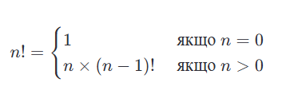

### На основі цього визначення можна легко створити рекурсивну функцію для обчислення факторіала:

def factorial(n):
    if n == 0: # базовий випадок
        return 1
    else:
        return n * factorial(n-1) # рекурсивний випадок

print(factorial(5)) # виведе 120

## У цьому прикладі:
### Базовий випадок: якщо n дорівнює 0, повернути 1. Це припиняє рекурсію, оскільки не відбувається додатковий виклик функції factorial.
### Рекурсивний випадок: якщо n не дорівнює 0, повернути **n,**помножену на factorial(n-1). 
### Ось тут і відбувається виклик функції factorial з аргументом, який на одиницю менший від поточного n, тому це є рекурсивний випадок.

### Цей код працює тому, що кожен виклик factorial(n-1) працює на дедалі меншому числі аж до того моменту, коли n дорівнює 0, і відбувається базовий випадок. 
### На цьому етапі рекурсія завершується, і результат починає "повертатися" назад через усі попередні виклики функції, обчислюючи добуток на кожному кроці.

### Числа Фібоначчі — це послідовність чисел, у якій кожне наступне число є сумою двох попередніх. Перші два числа в цій послідовності, за визначенням, дорівнюють 0 і 1.
### Математична формула для числа Фібоначчі:

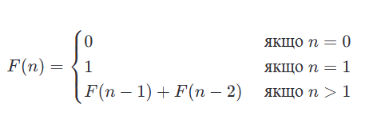

### Рекурсивний підхід до обчислення чисел Фібоначчі базується на прямому застосуванні цього визначення. 
### Ось як його можна реалізувати:

def fibonacci(n):
    if n <= 1: # базовий випадок
        return n
    else:
        return fibonacci(n-1) + fibonacci(n-2) # рекурсивний випадок

print(fibonacci(10)) # виведе 55

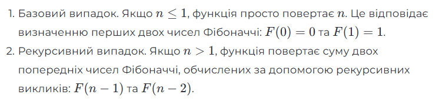

### Тут основна ідея в тому, що кожне число Фібоначчі є сумою двох попередніх чисел Фібоначчі (за винятком перших двох чисел). Тому щоб отримати $n$-е число Фібоначчі, вам потрібно додати 
### (n−1) та (n−2) числа Фібоначчі. І цей процес продовжується рекурсивно, доки ви не дійдете до базового випадку.

### Але що буде, якщо функція не матиме базового випадку і не повертатиме ніякого результату? Однією з потенційних проблем при використанні рекурсії є переповнення стеку. 
### Якщо рекурсивні виклики функції продовжуються без досягнення базового випадку, стек викликів може переповнитись, що призведе до помилки виконання. 
### Така помилка називається переповненням стеку (stack overflow, саме на її честь було названо популярний сайт https://stackoverflow.com). 
### Багаторазові виклики функцій без повернення збільшують стек викликів доти, доки не буде витрачено всю виділену йому пам'ять комп'ютера.

### Щоб цьому запобігти, інтерпретатори примусово завершують роботу програми після досягнення ліміту викликів функцій, які не повертають результат. 
### Така межа називається максимальною глибиною рекурсії, або максимальним розміром стеку викликів. У Python граничним значенням вважається 1000 викликів функцій.

## Стек викликів рекурсії

### Коли йдеться про рекурсію, ми зазвичай говоримо про функцію, яка викликає саму себе. Проте щоб краще зрозуміти, як рекурсія функціонує, потрібно зрозуміти, як комп'ютер обробляє виклики функцій взагалі. 
### Тут ми стикаємося з поняттям "стек викликів".

### Стек викликів — це специфічна частина пам'яті, яка використовується для зберігання інформації про активні виклики функцій. 
### Кожен раз, коли функція викликається, створюється новий запис (або "шар") у цьому стеку для цього конкретного виклику. 
### Цей шар містить інформацію про змінні функції, її параметри та місце, звідки була викликана функція, щоб після завершення виконання функції програма могла продовжити роботу з правильного місця.

### Тож коли функція викликає себе рекурсивно, кожен новий виклик функції зберігається в стеку викликів. Сам стек викликів створює інтерпретатор Python під час виконання програми.
### Якщо уявити стек як стопку книг, де кожна нова книга, яку ви кладете зверху, відображає новий виклик функції, то рекурсія — це додавання нових книг на верх стосу. 
### Коли функція завершує свою роботу, "книга" знімається зі стосу, і ми "повертаємося" до попередньої книги.

### Отже, коли базовий випадок досягнуто, виклики функцій починають "розвантажуватись" зі стеку, що дозволяє розрахувати кінцевий результат.
### Розглянемо приклад коду, який показує, як працює стек викликів у рекурсії на прикладі функції для обчислення факторіала числа:

def factorial(n):
    print("Виклик функції factorial з n = ", n)
    if n == 1:
        print("Базовий випадок, n = 1, повернення 1")
        return 1
    else:
        result = n * factorial(n-1)
        print("Повернення результату для n = ", n, ": ", result)
        return result

print(factorial(5))

### Цей код обчислює факторіал числа 5, який дорівнює 5 * 4 * 3 * 2 * 1 = 120. 
### Коли ви запустите цей код, ви побачите послідовність викликів рекурсивної функції і повернення результатів.

### Цей приклад показує, як кожен виклик рекурсивної функції додає новий "шар" у стек викликів, а кожен повернений результат видаляє "шар". 
### Базовий випадок (тут це n == 1) дозволяє завершити рекурсію і почати повертати результати.

### Виконаємо поглиблений аналіз нашого прикладу з факторіалом та додамо ілюстрації.
### Коли ви викликаєте factorial(5), створюється перший шар у стеку викликів для цього виклику. 
### Оскільки ця функція викликає себе знову, створюється ще один шар стеку для factorial(4), потім ще один для factorial(3) і так далі, доки не буде досягнуто базового випадку factorial(1).
### У цей момент рекурсія досягла своєї найбільшої глибини, і стек викликів містить п'ять шарів.

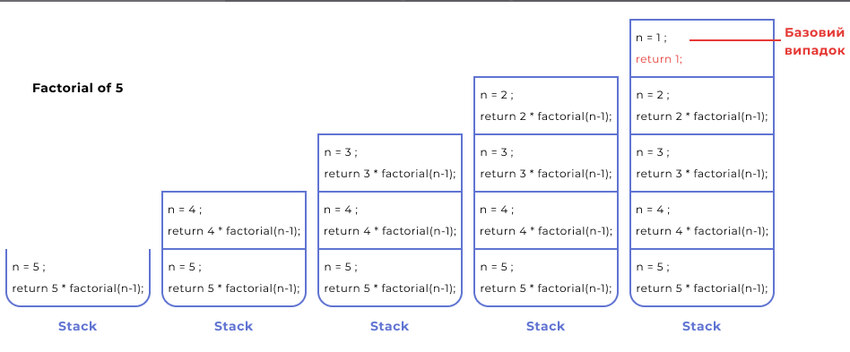

### Завершення виконання factorial(1) починає процес "розвантаження" стеку.
### Кожен шар, починаючи з останнього, обробляється, і результат кожного виклику повертається до попереднього виклику, доки весь стек не буде оброблений, і ми не отримаємо кінцевий результат для factorial(5).

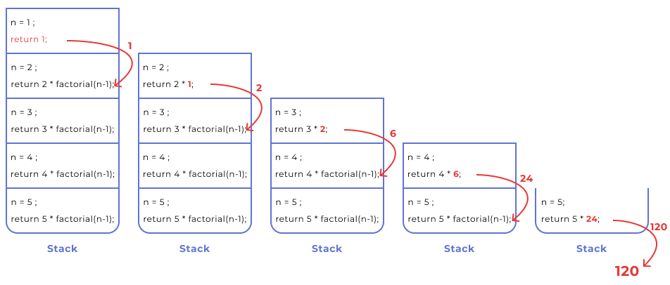

### Рекурсивні функції зручні в ситуаціях, коли ми не знаємо заздалегідь, скільки разів потрібно буде викликати функцію, наприклад, при розборі директорій на диску. 
### Застосунок не знає заздалегідь, наскільки глибока структура директорій і який у них рівень вкладеності. І щоб перебрати усі файли в усіх вкладених директоріях, функція повинна викликати сама себе, коли зустрічає чергову директорію. 
### Така функція, яка викликає сама себе за деяких умов, називається рекурсивною.